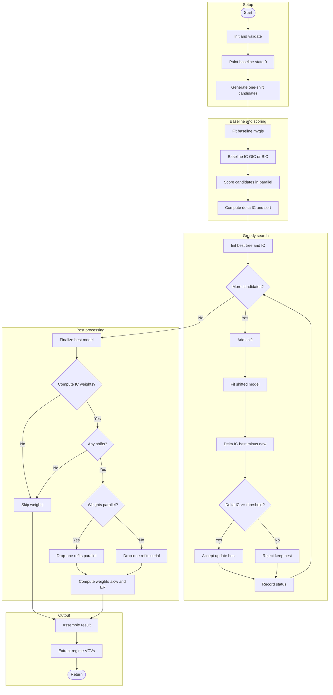

# bifrost 

<!-- badges: start -->
[](https://github.com/jakeberv/bifrost/actions/workflows/R-CMD-check.yaml)
[](https://app.codecov.io/gh/jakeberv/bifrost)
<!-- Old version (links to a non-existent CRAN page until first release)
[](https://CRAN.R-project.org/package=bifrost)
-->

[-blue.svg)](https://www.gnu.org/licenses/old-licenses/gpl-2.0.en.html)
[](https://lifecycle.r-lib.org/articles/stages.html)
<!-- badges: end -->

<span style="font-size:1.1em;">
  <strong>
    <span style="color:#c40000;">B</span>ranch-level
    <span style="color:#c40000;">I</span>nference
    <span style="color:#c40000;">F</span>ramework for
    <span style="color:#c40000;">R</span>ecognizing
    <span style="color:#c40000;">O</span>ptimal
    <span style="color:#c40000;">S</span>hifts in
    <span style="color:#c40000;">T</span>raits
  </strong>
</span>

`bifrost` performs branch-level inference of multi-regime, multivariate trait evolution on a phylogeny using [penalized-likelihood multivariate GLS fits](https://doi.org/10.1093/sysbio/syy045). The current version searches for evolutionary model shifts under a multi-rate Brownian Motion (BMM) model with proportional regime VCV scaling, operating directly in trait space (e.g., no PCA), and is designed for high-dimensional datasets (p > n) and large trees (> 1000 tips). The method will work with fossil tip-dated trees, and will accept most forms of multivariate comparative data (e.g., GPA aligned morphometric coordinates, linear dimensions, and others). The next major release will enable usage of the [multivariate scalar Ornstein–Uhlenbeck process](https://doi.org/10.1093/sysbio/syy005).

---

## Overview

- **Primary goal.** Infer *where*, *when*, and *how* patterns of phenotypic evolution change across a tree using many traits simultaneously.
- **Model.** Multi-rate Brownian Motion with regime-specific VCVs estimated via penalized-likelihood (`mvMORPH::mvgls`), supporting p ≳ n.
- **Search.** Greedy, step-wise acceptance of shifts guided by information criteria (**GIC** or **BIC**), with optional per-shift IC weights.
- **Scale.** Parallel candidate scoring using the `future` ecosystem; practical on thousands of taxa × traits.

---

## Key features

- Joint multivariate modeling without information loss or [distortion due to PCA](https://doi.org/10.1093/sysbio/syv019).
- Under BMM, [proportional VCV scaling](https://doi.org/10.1111/j.1558-5646.1999.tb05414.x) across regimes for tractability at high p.
- Provides a multivariate phylogenetic GLS (mvPGLS)-like framework in which hidden branch-specific rate regimes are inferred and incorporated when estimating predictor effects.
- Candidate shift nodes are determined by a minimum clade size specified by the user.
- Greedy [step-wise heuristic search](https://nph.onlinelibrary.wiley.com/doi/10.1111/nph.19099) using GIC/BIC ΔIC thresholds; optional IC-weight support for inferred shifts.
- Output includes estimated VCV per regime, shift weights, and SIMMAP-style mappings for downstream visualization and analysis.
- Parallelization via `future` / `future.apply`.

---

📄 **Vignette 1:** [Getting Started with bifrost](https://jakeberv.com/bifrost/articles/jaw-shape-vignette.html)

## Installation (development version)

```r
# install.packages("remotes")
remotes::install_github("jakeberv/bifrost")
```

**Windows users:**  
Install [Rtools](https://cran.r-project.org/bin/windows/Rtools/) for your R version and ensure it is added to your system PATH.

**macOS users:**  
You may need to install [XQuartz](https://www.xquartz.org/) to build or run packages that depend on certain graphical or system libraries.

---

### Quick start

```r
library(bifrost)
library(ape)
library(phytools)
library(mvMORPH)

set.seed(1)

# Simulate a tree
tr <- pbtree(n = 50, scale = 1)

# Paint a single global baseline state "0" (single regime)
base <- phytools::paintBranches(
  tr,
  edge      = unique(tr$edge[, 2]),
  state     = "0",
  anc.state = "0"
)

# Simulate multivariate traits under a single-regime BM1 model (no shifts)
sigma <- diag(0.1, 2)  # 2×2 variance–covariance matrix for two traits
theta <- c(0, 0)       # ancestral means for the two traits

sim <- mvSIM(
  tree  = base,
  nsim  = 1,
  model = "BM1",
  param = list(
    ntraits = 2,
    sigma   = sigma,
    theta   = theta
  )
)

# mvSIM returns either a matrix or a list of matrices depending on mvMORPH version
X <- if (is.list(sim)) sim[[1]] else sim
rownames(X) <- base$tip.label

# Run bifrost's greedy search for shifts
res <- searchOptimalConfiguration(
  baseline_tree              = base,
  trait_data                 = X,
  formula                    = "trait_data ~ 1",
  min_descendant_tips        = 10,
  num_cores                  = 1,
  shift_acceptance_threshold = 20,  # conservative GIC threshold
  IC                         = "GIC",
  plot                       = FALSE,
  store_model_fit_history    = FALSE,
  verbose                    = FALSE # set TRUE for progress messages 
)

# For this single-regime BM1 simulation, we typically expect no inferred shifts:
res$shift_nodes_no_uncertainty     # typically integer(0)
res$optimal_ic - res$baseline_ic   # typically close to 0

str(res$VCVs)  # regime-specific VCVs (here just the baseline regime "0")
```

### Data requirements

- **Tree and data alignment.** `rownames(trait_data)` must match `tree$tip.label` (same order and names).  
- **Branch lengths.** Interpreted in units of time; ultrametric not required.  
- **SIMMAP style.** Internally, regimes are stored using SIMMAP conventions (e.g., `phytools` class `simmap`) 
- **Multi-dimensional traits.** Works directly in trait space; tune penalties/methods using `mvgls` (mvMORPH) options for your data.  
- **Thresholds.** Use conservative `shift_acceptance_threshold` and `ic_uncertainty_threshold` to limit false positives; explore sensitivity.

### Core workflow



-----

### Primary functions

  - `searchOptimalConfiguration()`: The main function for end-to-end greedy search: candidate generation → parallel fitting → iterative acceptance → optional pruning/IC weights.
  - `plot_ic_acceptance_matrix()`: Visualize shift acceptance and information-criterion (IC) differences across search iterations.
  
### Helper functions (not exported)
  
  - **Candidate generation**: `generatePaintedTrees()`
  - **Model fitting helpers**: `fitMvglsAndExtractGIC()`, `fitMvglsAndExtractBIC()`, and formula variants.
  - **IC utilities**: `calculateAllDeltaGIC()`
  - **Tree painting utilities**: `paintSubTree_mod()`, `addShiftToModel()`, `removeShiftFromTree()`, `paintSubTree_removeShift()`, `whichShifts()`
  - **Regime VCVs**: `extractRegimeVCVs()`

-----

### Outputs

`searchOptimalConfiguration()` returns a comprehensive list containing:

- **`user_input`** — All arguments passed to `searchOptimalConfiguration()`, including the tree, trait data, IC choice, thresholds, and other parameters for reproducibility.
- **`tree_no_uncertainty_transformed`** — Optimal SIMMAP tree with accepted shifts, using transformed branch lengths (if a branch-length transformation was applied).
- **`tree_no_uncertainty_untransformed`** — Same optimal SIMMAP tree but with original, untransformed branch lengths.
- **`model_no_uncertainty`** — Final fitted `mvgls` model object (BM or multi-rate BMM), including estimated parameters, log-likelihood, and variance–covariance matrices.
- **`shift_nodes_no_uncertainty`** — Node numbers corresponding to accepted evolutionary shifts.
- **`optimal_ic`** — Information criterion (IC) value for the optimal model.
- **`baseline_ic`** — IC value for the null (single-rate) baseline model.
- **`IC_used`** — The information criterion applied (`"GIC"` or `"BIC"`).
- **`num_candidates`** — Total number of candidate models evaluated during the search.
- **`model_fit_history`** — Per-iteration log of model fits, IC values, and acceptance decisions; useful for visualizing or debugging search behavior.
- **`VCVs`** — Regime-specific penalized-likelihood variance–covariance matrices.
- **`ic_weights`** — Data frame of per-shift IC weights and evidence ratios (if `uncertaintyweights_par = TRUE`), providing support values for individual shifts.

-----


### Performance and scalability

Enable parallel processing using the `future` package:

```r
library(future)
plan(multisession)   # or multicore on Linux/macOS
```

  - **Reduce plotting** (`plot = FALSE`) for large trees.
  - **Increase memory** for heavy runs, especially with high `p`.
  - Consider **larger `min_descendant_tips`** and stricter IC thresholds on very large problems.
  - **Repeat searches** with different seeds and thresholds to check for robustness.

-----

### Reproducibility

  - **Record `sessionInfo()`** and the `mvMORPH` version.
  - For projects, consider using `renv` to lock package versions.

-----

### Additional note

Though `bifrost` was initially developed as a framework for inferring macroevolutionary regime shifts in multivariate trait data, it can also be applied to perform multivariate phylogenetic generalized least squares (pGLS) analyses with factors or continuous predictors (e.g., `cbind(trait1, trait2, ...) ~ predictor`, or `"trait_data[, 1:5] ~ trait_data[, 6]"` when working directly with a matrix). In this context, `bifrost` identifies branch-specific rate variation under a multi-rate Brownian Motion model and fits the pGLS conditional on the resulting residual (phylogenetic) covariance structure, so estimated effect sizes and uncertainties account for “hidden” rate variation not explained by the predictors. This is conceptually similar to hidden-state approaches (e.g., [Boyko et al. 2023](https://doi.org/10.1093/evolut/qpad002)), except that here the regimes influence variance and evolutionary rate rather than introducing regime-specific means. This use case is an active area of ongoing methodological development.

### Citation

If you use `bifrost`, please cite the references returned by:

```r
citation("bifrost")
```

-----

### Contributing

Bug reports, feature requests, and pull requests are welcome. Please open an issue at [https://github.com/jakeberv/bifrost/issues](https://github.com/jakeberv/bifrost/issues).

-----

### License

This project is released under the GPL >= 2 License. See the `LICENSE` file for details.

-----

### Acknowledgements and dependencies

`bifrost` builds on substantial work from `mvMORPH`, `phytools`, `ape`, `future`, and `future.apply`. The greedy search algorithm is adapted from [Mitov et al 2019](https://www.pnas.org/doi/10.1073/pnas.1813823116) and [Smith et al 2023](https://nph.onlinelibrary.wiley.com/doi/10.1111/nph.19099). See the `DESCRIPTION` file for complete dependency and version information.

The name of our R package is inspired by the Bifröst, the rainbow bridge of Norse mythology that connects Earth (Midgard) and Asgard within the cosmic structure of Yggdrasil, the Tree of Life, echoing how our framework links observable data to hidden evolutionary shifts across the history of life.

Development of the `bifrost` R package was supported by the [Oxford Research Software Engineering Group](https://www.rse.ox.ac.uk/schmidt-ai-science), with support from [Schmidt Sciences, LLC.](https://www.schmidtsciences.org/ai-in-science/) and the [Michigan Institute for Data Science and AI in Society](https://midas.umich.edu/).

<p align="center" style="display:flex; justify-content:center; align-items:center; gap:50px; padding:30px 0;">
  
  
</p>


