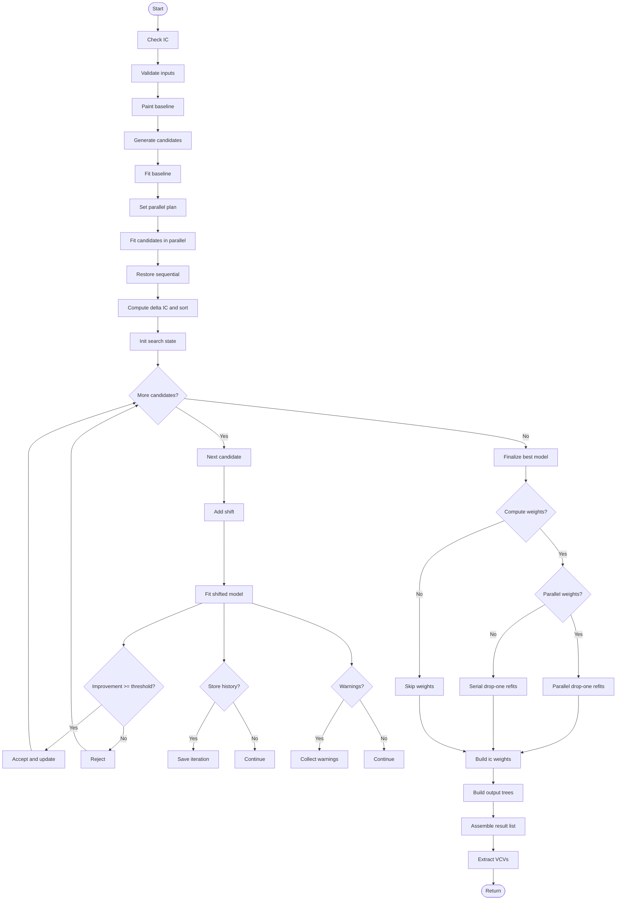

# bifrost 

<!-- badges: start -->
[](https://github.com/jakeberv/bifrost/actions/workflows/R-CMD-check.yaml)
[](https://app.codecov.io/gh/jakeberv/bifrost)
[](https://CRAN.R-project.org/package=bifrost)
[-blue.svg)](LICENSE.md)
[](https://lifecycle.r-lib.org/articles/stages.html)
<!-- badges: end -->

**Branch-level Inference Framework for Recognizing Optimal Shifts in Traits**

`bifrost` performs branch-level inference of multi-regime trait evolution on a phylogeny using penalized-likelihood multivariate GLS fits. It searches for evolutionary rate shifts under a multi-rate Brownian Motion (BMM) model with proportional regime VCV scaling, operating directly in trait space (no PCA), and is designed for high-dimensional datasets and large trees.

---

## Overview

- **Goal.** Infer *where*, *when*, and *how fast* phenotypic evolution accelerates or slows across a tree using many traits simultaneously.
- **Model.** Multi-rate Brownian Motion with regime-specific VCVs estimated via penalized-likelihood (`mvMORPH::mvgls`), supporting p ≳ n.
- **Search.** Greedy, stepwise acceptance of shifts guided by information criteria (**GIC** or **BIC**), with optional post-hoc pruning and per-shift IC weights.
- **Scale.** Parallel candidate scoring using the `future` ecosystem; practical on thousands of taxa × traits.

---

## Key features

- Joint multivariate modeling without PCA information loss.
- Proportional VCV scaling across regimes for tractability at high p.
- Candidate generation on internal nodes with minimum clade size filters.
- Greedy acceptance using ΔIC thresholds; optional uncertainty phase with IC weights.
- Regime VCV extraction and utilities for painting/unpainting SIMMAP shifts.
- Parallelization via `future` / `future.apply`.

---

📄 **Vignette:** [Getting Started with bifrost](https://jakeberv.com/bifrost/articles/jaw-shape-vignette.html)

## Installation

```r
# install.packages("remotes")
remotes::install_github("jakeberv/bifrost")

Windows users: install Rtools for your R version and ensure it is on the PATH.

⸻

Quick start

library(bifrost)
library(ape)

set.seed(1)
tree   <- rtree(50)
traits <- matrix(rnorm(50 * 5), ncol = 5)
rownames(traits) <- tree$tip.label   # critical: rownames must match tip labels

res <- searchOptimalConfiguration(
  baseline_tree = tree,
  trait_data = traits,
  IC = "GIC",
  min_descendant_tips = 5,
  num_cores = 2,
  shift_acceptance_threshold = 10,
  plot = FALSE
)

res$shift_nodes
plotSimmap(res$tree_no_uncertainty)

``` 

⸻

Data requirements and good practice
- Tree and data alignment. `rownames(trait_data)` must match `tree$tip.label` (same order and names).
- Branch lengths. Interpreted in units of time; ultrametric not required.
- SIMMAP style. Internally, regimes are stored using SIMMAP conventions.
- High-dimensional traits. Works directly in trait space; tune penalties/methods in mvgls options for your data.
- Thresholds. Use conservative `shift_acceptance_threshold` and `ic_uncertainty_threshold` to limit false positives; explore sensitivity.

⸻

Core workflow


-----

## Primary functions

  - `searchOptimalConfiguration()`: The main function for end-to-end greedy search: candidate generation → parallel fitting → iterative acceptance → optional pruning/IC weights.
  - add the plotting function
  
## Helper functions
  
  - **Candidate generation**: `generatePaintedTrees()`
  - **Model fitting helpers**: `fitMvglsAndExtractGIC()`, `fitMvglsAndExtractBIC()`, and formula variants.
  - **IC utilities**: `calculateAllDeltaGIC()`
  - **Tree painting utilities**: `paintSubTree_mod()`, `addShiftToModel()`, `removeShiftFromTree()`, `paintSubTree_removeShift()`, `whichShifts()`
  - **Regime VCVs**: `extractRegimeVCVs()`

-----

## Outputs

The list returned by `searchOptimalConfiguration()` contains:

- **`user_input`**: A record of all arguments passed to `searchOptimalConfiguration()`, storing tree, trait data, IC choice, thresholds, and other run parameters for reproducibility.
- **`tree_no_uncertainty_transformed`**: Optimal SIMMAP tree with accepted shifts, using transformed branch lengths (if branch-length transformation was applied).
- **`tree_no_uncertainty_untransformed`**: The same optimal SIMMAP tree but retaining original, untransformed branch lengths.
- **`model_no_uncertainty`**: Final fitted `mvgls` model object (BM or multi-rate BMM), containing estimated parameters, log-likelihood, and variance-covariance matrices.
- **`shift_nodes_no_uncertainty`**: Integer node numbers corresponding to accepted shifts on the phylogeny.
- **`optimal_ic`**: Final model’s information criterion (IC) value, used to quantify model fit.
- **`baseline_ic`**: IC value of the null (single-rate) baseline model.
- **`IC_used`**: Character string indicating which IC was used (e.g. `"GIC"` or `"BIC"`).
- **`num_candidates`**: Total number of candidate models evaluated during the search process.
- **`model_fit_history`**: Detailed per-iteration record of candidate fits, IC values, and acceptance decisions. Useful for plotting search behavior or debugging.
- **`VCVs`**: List of regime-specific penalized-likelihood variance-covariance matrices, one per regime.
- **`ic_weights`**: Data frame of per-shift IC weights and evidence ratios (if `uncertaintyweights_par = TRUE` was used), allowing assessment of support for individual shifts.


-----


## Performance and scalability

Enable parallel processing using the `future` package:

```r
library(future)
plan(multisession)   # or multicore on Linux/macOS
```

  - **Reduce plotting** (`plot = FALSE`) for large trees.
  - **Increase memory** for heavy runs, especially with high `p`.
  - Consider **larger `min_descendant_tips`** and stricter IC thresholds on very large problems.
  - **Repeat searches** with different seeds and thresholds to check for robustness.

-----

## Reproducibility

  - **Set a seed** with `set.seed()` before candidate generation and search.
  - **Record `sessionInfo()`** and the `mvMORPH` version.
  - For projects, consider using `renv` to lock package versions.

-----

## Citation

If you use `bifrost`, please cite:

> TBD

Also, run the following to obtain a BibTeX entry when available:

```r
citation("bifrost")
```

-----

## Contributing

Bug reports, feature requests, and pull requests are welcome. Please open an issue at [https://github.com/jakeberv/bifrost/issues](https://github.com/jakeberv/bifrost/issues).

-----

## License

This project is released under the GPL >= 2 License. See the `LICENSE` file for details.

-----

## Acknowledgements and dependencies

`bifrost` builds on the work from `mvMORPH`, `phytools`, `ape`, `future`, and `future.apply`. See the `DESCRIPTION` file for complete dependency and version information.
