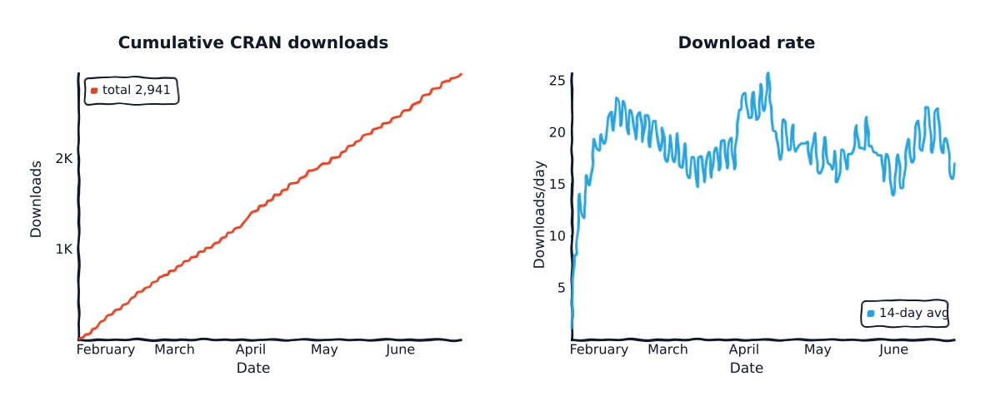

# bifrost 

<!-- badges: start -->
[](https://github.com/jakeberv/bifrost/actions/workflows/R-CMD-check.yaml)
[](https://app.codecov.io/gh/jakeberv/bifrost)
[](https://CRAN.R-project.org/package=bifrost)
[](https://cran.r-project.org/package=bifrost)
[](https://doi.org/10.64898/2026.04.12.718036)
[-blue.svg)](https://www.gnu.org/licenses/old-licenses/gpl-2.0.en.html)
[](https://lifecycle.r-lib.org/articles/stages.html)
<!-- badges: end -->

<span style="font-size:1.1em;">
  <strong>
    <span style="color:#c40000;">B</span>ranch-level
    <span style="color:#c40000;">I</span>nference
    <span style="color:#c40000;">F</span>ramework for
    <span style="color:#c40000;">R</span>ecognizing
    <span style="color:#c40000;">O</span>ptimal
    <span style="color:#c40000;">S</span>hifts in
    <span style="color:#c40000;">T</span>raits
  </strong>
</span>

`bifrost` performs branch-level inference of multi-regime, multivariate trait evolution on a phylogeny using [penalized-likelihood multivariate GLS fits](https://doi.org/10.1093/sysbio/syy045). The current version searches for evolutionary model shifts under a multi-rate Brownian Motion (BMM) model with proportional regime VCV scaling, operates directly in trait space (for example, without PCA), and is designed for high-dimensional datasets (`p > n`) and large trees (`> 1000` tips).

The method works with fossil tip-dated trees and with a wide range of multivariate comparative data, including GPA-aligned morphometric coordinates, linear dimensions, and related trait matrices. A future major release will add support for the [multivariate scalar Ornstein-Uhlenbeck process](https://doi.org/10.1093/sysbio/syy005).

## CRAN downloads

<p align="center">
  <a href="man/figures/cran-downloads.png">
    
  </a>
</p>

## Installation

### Stable release

```r
install.packages("bifrost")
```

### Development version

```r
# install.packages("remotes")
remotes::install_github("jakeberv/bifrost")
```

**Windows users:**  
Install [Rtools](https://cran.r-project.org/bin/windows/Rtools/) for your R version and ensure that it is added to your system `PATH`.

**macOS users:**  
You may need to install [XQuartz](https://www.xquartz.org/) to build or run packages that depend on certain graphical or system libraries.

## Release status

CRAN currently provides `bifrost` 0.1.4. The GitHub development version includes repository-only additions documented here but not yet available from CRAN:

- Search histories can now be inspected with the `icTrajectory()` extractor and plotted directly with `plot()`, for example `traj <- icTrajectory(search); plot(traj)`. The older `plot_ic_acceptance_matrix()` helper remains available as a compatibility wrapper.
- Stored model-fit histories now include richer per-candidate records, including errored candidate fits, so search diagnostics can preserve accepted, rejected, and errored proposals.
- The `rateMap()` workflow, along with `rateMapView()`, `rateMapControl()`, `rateMapRateFlags()`, and `plot()` / `print()` methods for `rateMap` objects, summarizes and visualizes branch-rate patterns from completed `bifrost` searches. The two rate-map jaw-shape articles below are part of this development-version documentation.
- `lineage_rates()` and the shift-distribution toolkit summarize inherited lineage rates, shift timing and waiting times, rate-distribution fits, and shift-magnitude patterns from completed searches.
- Regime covariance and integration tools fit and summarize per-regime covariance structure, diagnose modules and correlation-space variation, compare integration relationships, and support post-hoc pGLS analyses.
- The simulation framework creates reproducible null and shifted datasets, evaluates strict and fuzzy shift recovery, runs fixed-IC tuning grids, and selects search settings using fuzzy balanced accuracy by default. The original manuscript generator remains the default, with the empirically calibrated full-covariance generator available explicitly.
- Formula-based searches now accept formula objects as well as character strings, support numeric response-only data frames for intercept-only searches, and support named-column data-frame formulas such as `cbind(y1, y2) ~ size + grp` for pGLS-style workflows.
- The development version requires R 4.2 or newer.

Some repository workflows are still being actively developed, especially methodological guidance for pGLS-style uses of `bifrost` with hidden branch-specific rate variation. Repository tooling and generated site assets, such as the CRAN downloads tracker, support development and documentation rather than the core CRAN API.

All source vignettes listed below are maintained as website articles and excluded from the CRAN package tarball. This avoids rebuilding manuscript-scale demonstrations, including the five-part avian skeleton workflow, during CRAN checks while keeping the complete documentation available through pkgdown.

## Overview

- **Primary goal.** Infer *where*, *when*, and *how* patterns of phenotypic evolution change across a tree using many traits simultaneously.
- **Model.** Multi-rate Brownian Motion with regime-specific VCVs estimated via penalized-likelihood (`mvMORPH::mvgls`), supporting `p >= n`.
- **Search.** Greedy, step-wise acceptance of shifts guided by information criteria (`GIC` or `BIC`), with optional per-shift IC weights.
- **Scale.** Parallel candidate scoring using the `future` ecosystem; practical on thousands of taxa x traits.

## Key features

- Joint multivariate modeling without information loss or [distortion due to PCA](https://doi.org/10.1093/sysbio/syv019).
- Under BMM, [proportional VCV scaling](https://doi.org/10.1111/j.1558-5646.1999.tb05414.x) across regimes for tractability at high `p`.
- Provides a multivariate phylogenetic GLS (mvPGLS)-like framework in which hidden branch-specific rate regimes are inferred and incorporated when estimating predictor effects.
- Candidate shift nodes are determined by a minimum clade size specified by the user.
- Output includes estimated VCV per regime, shift weights, and SIMMAP-style mappings for downstream visualization and analysis.

## Documentation

### Background and theory

- [Brownian Motion and Multivariate Shifts](https://jakeberv.com/bifrost/articles/theoretical-background-vignette.html)  
  Conceptual background on Brownian motion, multivariate covariance, and what branch-specific shifts mean in `bifrost`.
- [Whole-Tree Models, PCA, and bifrost](https://jakeberv.com/bifrost/articles/pca-model-selection-and-bifrost-vignette.html)  
  Explains why whole-tree homogeneous models and PCA truncation can mislead inference when evolutionary processes vary across the tree.

### Getting Started

- [Quick Start with bifrost](https://jakeberv.com/bifrost/articles/quick-start-vignette.html)  
  A practical introduction to the core `bifrost` workflow using a minimal simulated example, including setup, key arguments, outputs, and interpretation.
- [Detecting Evolutionary Shifts in Paleozoic Fish Jaw Shape with bifrost](https://jakeberv.com/bifrost/articles/jaw-shape-vignette.html)  
  A full empirical case study using the packaged fossil jaw-shape dataset, showing how to run, inspect, and interpret a real `bifrost` analysis end to end.

### Rate Mapping

- [Mapping Sensitivity in Jaw-Shape Evolutionary Rates with rateMap, Part 1](https://jakeberv.com/bifrost/articles/rate-map-jaw-shape-vignette.html)
  A follow-up case study showing the compute-first `rateMap()` workflow: build a reusable branch-rate summary object from completed searches, diagnose broad fitted-rate ranges, and display near-zero branches with explicit diagnostic metadata.
- [Mapping Sensitivity in Jaw-Shape Evolutionary Rates with rateMap, Part 2](https://jakeberv.com/bifrost/articles/rate-map-jaw-shape-part-2-comparisons.html)
  Extends the same jaw-shape sweep into IC weighting, uncertainty summaries, same-topology tree samples, original-scale rates, interval maps, and additional diagnostics.

### Avian Skeleton Case Study

- [Passerine Body Plan Evolution, Part 1: Fitting and Inspecting a Search](https://jakeberv.com/bifrost/articles/avian-skeleton-part-1.html)
  Introduces the empirical dataset, fits the manuscript-scale search, and inspects the inferred shifts and IC trajectory.
- [Passerine Body Plan Evolution, Part 2: Lineage-Rate Summaries](https://jakeberv.com/bifrost/articles/avian-skeleton-part-2.html)
  Reconstructs tip-level lineage-rate summaries and visualizes their temporal and spatial variation.
- [Passerine Body Plan Evolution, Part 3: Shift Timing and Distribution Fits](https://jakeberv.com/bifrost/articles/avian-skeleton-part-3.html)
  Extracts shift events and evaluates waiting-time and lineage-rate distributions.
- [Passerine Body Plan Evolution, Part 4: Shift Magnitude Comparisons](https://jakeberv.com/bifrost/articles/avian-skeleton-part-4.html)
  Quantifies and compares the magnitudes of inferred rate shifts among biological groups.
- [Passerine Body Plan Evolution, Part 5: Post-hoc Integration and Covariance Structure](https://jakeberv.com/bifrost/articles/avian-skeleton-part-5.html)
  Examines regime-specific covariance, modularity, integration, and post-hoc phylogenetic relationships.

### Simulation and Calibration

- [Empirically Calibrated Simulations for bifrost, Part 1: Performance](https://jakeberv.com/bifrost/articles/simulation-study-part-1.html)
  Builds reproducible null and shifted simulations and reports false-positive behavior and strict and fuzzy shift recovery.
- [Empirically Calibrated Simulations for bifrost, Part 2: Tuning and Application](https://jakeberv.com/bifrost/articles/simulation-study-part-2.html)
  Tunes search controls with null safeguards and fuzzy balanced accuracy, then carries the selected settings into empirical analysis.

## Additional note

Though `bifrost` was initially developed as a framework for inferring macroevolutionary regime shifts in multivariate trait data, it can also be applied to perform multivariate phylogenetic generalized least squares (pGLS) analyses with factors or continuous predictors (e.g., `cbind(trait1, trait2, ...) ~ predictor`, or `"trait_data[, 1:5] ~ trait_data[, 6]"` when working directly with a matrix). In this context, `bifrost` identifies branch-specific rate variation under a multi-rate Brownian Motion model and fits the pGLS conditional on the resulting residual (phylogenetic) covariance structure, so estimated effect sizes and uncertainties account for "hidden" rate variation not explained by the predictors. This is conceptually similar to hidden-state approaches (e.g., [Boyko et al. 2023](https://doi.org/10.1093/evolut/qpad002)), except that here the regimes influence variance and evolutionary rate rather than introducing regime-specific means. This use case is an active area of ongoing methodological development.

## Citation

If you use `bifrost`, please cite the package and methods references below. The same set is also available from:

```r
citation("bifrost")
```

### Recommended citations

1. `bifrost` methods / application paper  
   Berv JS, Probst CM, Claramunt S, Shipley JR, Friedman M, Smith SA, Fouhey DF, Weeks BC (2026). *Rates of passerine body plan evolution in time and space*. *Nature Ecology & Evolution*. [https://doi.org/10.1038/s41559-026-03110-5](https://doi.org/10.1038/s41559-026-03110-5)

2. `bifrost` preprint  
   Berv JS, Fox N, Thorstensen MJ, Lloyd-Laney H, Troyer EM, Rivero-Vega RA, Smith SA, Friedman M, Fouhey DF, Weeks BC (2026). *bifrost: an R package for scalable inference of phylogenetic shifts in multivariate evolutionary dynamics*. *bioRxiv*. [https://doi.org/10.64898/2026.04.12.718036](https://doi.org/10.64898/2026.04.12.718036)

3. `bifrost` software citation  
   Berv JS, Fox N, Thorstensen MJ, Lloyd-Laney H, Troyer EM, Rivero-Vega RA, Smith SA, Friedman M, Fouhey DF, Weeks BC (2026). *Branch-Level Inference Framework for Recognizing Optimal Shifts in Traits*. R package version 0.1.4. [https://CRAN.R-project.org/package=bifrost](https://CRAN.R-project.org/package=bifrost)

4. `mvMORPH` package paper  
   Clavel J, Escarguel G, Merceron G (2015). *mvmorph: an R package for fitting multivariate evolutionary models to morphometric data*. *Methods in Ecology and Evolution*, 6(11), 1311-1319. [https://doi.org/10.1111/2041-210X.12420](https://doi.org/10.1111/2041-210X.12420)

5. Penalized-likelihood framework paper  
   Clavel J, Aristide L, Morlon H (2019). *A Penalized Likelihood Framework for High-Dimensional Phylogenetic Comparative Methods and an Application to New-World Monkeys Brain Evolution*. *Systematic Biology*, 68(1), 93-116. [https://doi.org/10.1093/sysbio/syy045](https://doi.org/10.1093/sysbio/syy045)

## Contributing

Bug reports, feature requests, and pull requests are welcome. Please open an issue at [https://github.com/jakeberv/bifrost/issues](https://github.com/jakeberv/bifrost/issues).

## License

This project is released under the GPL (>= 2) License. See the `LICENSE` file for details.

## Acknowledgements and dependencies

`bifrost` builds on substantial work from `mvMORPH`, `phytools`, `ape`, `future`, and `future.apply`. The greedy search algorithm is adapted from [Mitov et al. 2019](https://www.pnas.org/doi/10.1073/pnas.1813823116) and [Smith et al. 2023](https://nph.onlinelibrary.wiley.com/doi/10.1111/nph.19099). See the `DESCRIPTION` file for complete dependency and version information.

The name of our R package is inspired by the Bifröst, the rainbow bridge of Norse mythology that connects Earth (Midgard) and Asgard within the cosmic structure of Yggdrasil, the Tree of Life, echoing how this framework links observable data to hidden evolutionary shifts across the history of life.

Development of the `bifrost` R package was supported by the [Oxford Research Software Engineering Group](https://www.rse.ox.ac.uk/schmidt-ai-science), with support from [Schmidt Sciences, LLC.](https://www.schmidtsciences.org/ai-in-science/) and the Michigan Institute for Data Science and AI in Society.

<p align="center" style="display:flex; justify-content:center; align-items:center; gap:50px; padding:30px 0;">
  
  
</p>
