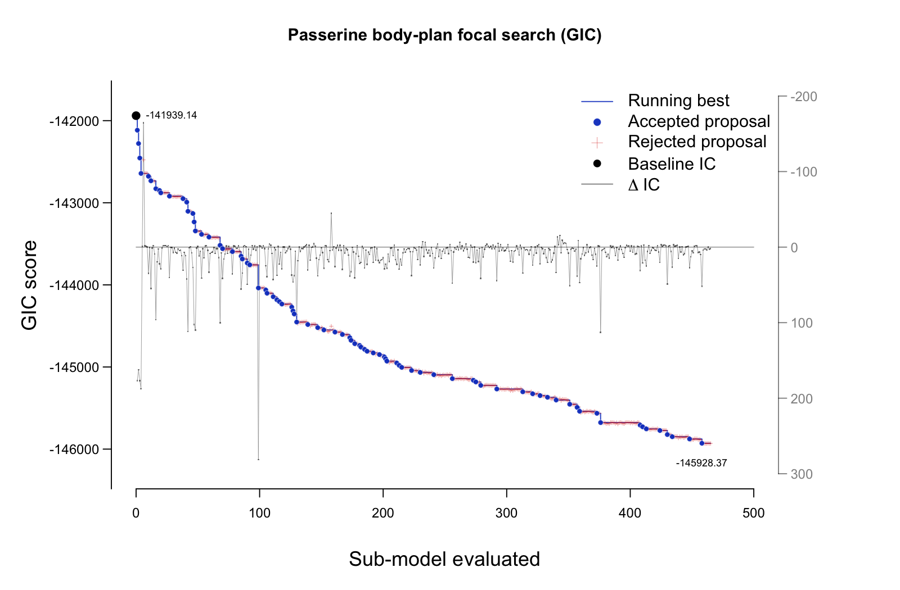
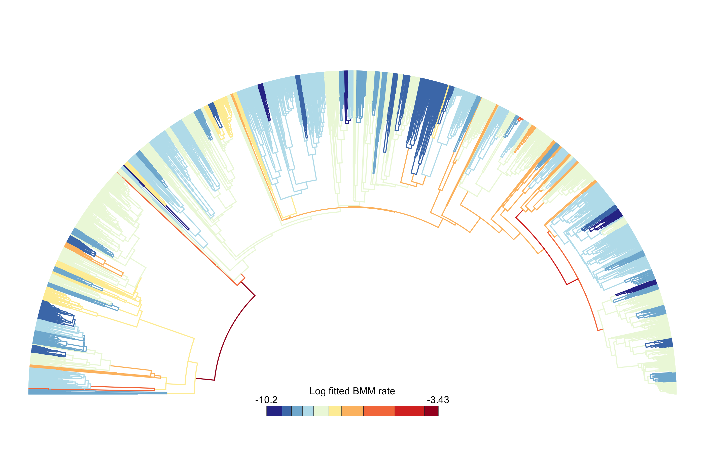

```{r, include = FALSE}
library(bifrost)
library(ape)
library(classInt)
library(RColorBrewer)

knitr::opts_chunk$set(
  collapse = TRUE,
  comment = "#>"
)

vignette_figure_caption <- function(html, latex) {
  pandoc_to <- knitr::opts_knit$get("rmarkdown.pandoc.to")
  if (is.character(pandoc_to) && length(pandoc_to) == 1L && grepl("^html", pandoc_to)) html else latex
}

```
```{r, echo=FALSE, results='asis'}
if (knitr::is_html_output()) {
  cat('<style>
/* Remove any default borders/shadows around vignette/pkgdown images */
img, .figure img, .figure > p > img {
  border: 0 !important;
  box-shadow: none !important;
  outline: none !important;
  background: transparent !important;
}

p.caption, .caption {
  border-left: 0.32rem solid #d8dde3;
  color: #2f3439;
  font-size: inherit;
  line-height: inherit;
  margin: 0 3.8% 1.05rem 3.8%;
  padding: 0 0 0 1rem;
  text-align: left !important;
}

p.caption strong, .caption strong {
  font-weight: 700;
}

code {
  overflow-wrap: anywhere;
  word-break: break-word;
}

div.sourceCode,
pre.sourceCode,
pre,
pre code,
code.sourceCode,
pre > code.sourceCode,
pre > code.sourceCode > span {
  max-width: 100%;
  white-space: pre-wrap !important;
  overflow-wrap: anywhere !important;
  word-break: break-word !important;
}

div.sourceCode,
pre {
  overflow-x: auto;
}

pre > code.sourceCode > span {
  display: inline !important;
  text-indent: 0 !important;
  padding-left: 0 !important;
}

@media (max-width: 640px) {
  img, .figure img, .figure > p > img {
    width: 100% !important;
    height: auto !important;
  }
}
</style>
')
}
```

## Introduction

Berv et al. (2026) used `bifrost` to study how rates of multivariate skeletal evolution vary across the passerine phylogeny. Their focal temporal analysis paired a 2,057-tip time-scaled passerine tree based on Claramunt et al. (2025) with species-level skeletal measurements from the Skelevision pipeline (Weeks et al. 2023; Weeks et al. 2025). The model asks how 12 logged skeletal dimensions evolve while conditioning on logged body mass (`vertnet_mass`), so the inferred rate shifts describe body-plan evolution beyond allometric size effects.

That design also illustrates a common `bifrost` use case beyond intercept-only analyses of morphometric coordinate datasets, such as the [jaw-shape vignette](jaw-shape-vignette.html). With a multivariate response and an additional predictor, `bifrost` fits a Brownian motion model (BMM) PGLS-style regression while allowing hidden rate regimes across the phylogeny. Depending on the question, those hidden regimes can be the focal biological signal or the phylogenetic covariance structure used to estimate regression parameters.

### What this workflow covers

The complete Berv et al. (2026) search repeatedly fits and compares candidate hidden-rate configurations across a large phylogeny. That is the analysis to run for a full empirical study, but it is too slow and memory-intensive for a package vignette. These worked examples therefore use compact package-local objects:

- Part 1 specifies the focal search, then inspects a compact precomputed `bifrost_search` object that preserves the final fitted model, accepted shifts, mapped tree, fitted regime rates, and information-criterion trajectory.
- Part 2 uses the same compact focal result to compute lineage-rate summaries.
- Part 3 uses the compact focal result for shift-transition tables, branch-rate annotations, rate distributions, waiting times, and waiting-time distribution fits.
- Part 4 first uses the compact focal result for a single-run shift-magnitude example, then uses the compact sensitivity bundle for pooled comparisons.
- Part 5 uses compact post-hoc covariance summaries to ask whether the temporal rate regimes also differ in independently refit integration structure.

The package includes the lightweight inputs needed for the workflow: the passerine tree, a 13-column species-level matrix containing 12 skeletal measurements and `vertnet_mass`, compact focal and sensitivity search objects, and a compact post-hoc integration bundle. The complete Berv et al. (2026) archive remains the source for proposal history, sensitivity searches, and candidate model fits.

<br>

```{r bodyplan_fig1, echo=FALSE, fig.align="center", out.width="100%", fig.alt="Figure 1 from Berv et al. (2026), showing the focal phylogenetic rate-shift analysis and associated spatial summaries.", fig.cap=vignette_figure_caption("**Figure 1 from Berv et al. (2026), *Nature Ecology & Evolution*.** The published figure anchors the workflow: panel A shows the focal temporal branch-rate analysis revisited across these vignettes, while panels B-E show the spatial summaries and species-richness context from the paper.", "Berv et al. (2026), Nature Ecology \\& Evolution. The published figure anchors the workflow: panel A shows the focal temporal branch-rate analysis revisited across these vignettes, while panels B-E show the spatial summaries and species-richness context from the paper.")}
knitr::include_graphics("avian-skeleton/bodyplan_figure1.png")
```

## Setup

```{r load_packages, eval=FALSE}
# bifrost supplies the search helpers; ape reads the tree.
library(bifrost)
library(ape)

# classInt and RColorBrewer match the Berv et al. (2026) rate bins and palette.
library(classInt)
library(RColorBrewer)
```

## Data Sources and Availability

### Package-local inputs

The examples below use four package-local files:

- tree: `inst/extdata/avian-skeleton/passerine_bodyplan_tree.tre`
- trait matrix: `inst/extdata/avian-skeleton/passerine_bodyplan_data.RDS`
- compact focal search result: `inst/extdata/avian-skeleton/passerine_bodyplan_search_compact.RDS`
- compact sensitivity search results: `inst/extdata/avian-skeleton/passerine_bodyplan_search_sensitivity_compact.RDS`

The tree and trait matrix reproduce the `searchOptimalConfiguration()` setup shown below. The compact focal result preserves the fitted BMM regime-rate parameters, mapped SIMMAP trees, accepted shifts, regime VCVs, IC weights, and IC acceptance matrix used by `icTrajectory()`, but omits the full optimized `mvgls` object and individual candidate fits. The compact sensitivity bundle keeps mapped trees, BMM regime rates, and compact IC acceptance matrices for downstream examples. Use the full Zenodo archive for proposal-level history, sensitivity searches, full fitted model objects, and proposal metadata.

### Complete Berv et al. archive

Zenodo hosts the complete Berv et al. (2026) archive as a single `data.tar.gz` download (15.2 GB): <https://doi.org/10.5281/zenodo.19198393>. The archive expands to the full `data/` directory that the companion Berv et al. (2026) codebase uses.

The archive includes these vignette-relevant files:

- trait matrix: `data/temporal/01_core_inputs/external_skelevision/dat.mvgls.RDS`
- time-scaled tree: `data/temporal/01_core_inputs/external_skelevision/ythlida_supertree.rescale.tre`
- species metadata for companion Berv et al. (2026) workflows: `data/temporal/01_core_inputs/external_skelevision/sampled_cv.RDS`
- full focal run: `data/temporal/02_shift_search/new_bifrost/min10.ic20.gic.RDS`

### Species-level trait matrix

The packaged `passerine_bodyplan_data.RDS` object is the assembled species-level comparative matrix used in the Berv et al. (2026) temporal analysis. It has one row per species: 2,057 passerine species by 13 columns, with 12 skeletal traits plus `vertnet_mass`. It is not the raw specimen-level table. The underlying Skelevision workflow measured skeletal elements from photographs of museum voucher skeletons using U-Net and Mask R-CNN (Weeks et al. 2023; Weeks et al. 2025). Those specimen-level data comprise 14,419 voucher specimens spanning the same 2,057 passerine species, covering 34% of passerine species and 89% of passerine families.

The 12 skeletal columns in the packaged matrix span the hindlimb (`femur`, `tarsus` = tibiotarsus, `metatarsus` = tarsometatarsus), forelimb (`humerus`, `ulna`, `radius`, `carpometacarpus`, `second_digit` = second digit phalanx), and axial/cranial skeleton (`cv.keel.1` = keel, `cv.furcula.1` = furcula, `sclerotic_ring`, `cv.skull.1` = skull-bill length). The companion dataset already imputes missing skeletal values with a multivariate evolutionary model, so the packaged matrix contains complete species-level data.

`vertnet_mass` likewise gives an assembled species-level covariate rather than a direct image measurement. Following the companion dataset workflow, Berv et al. (2026) pulled body masses from specimen label metadata archived through VertNet. In the underlying specimen set, 54.2% of individual skeletons had recorded masses, and 69.2% of species had at least one mass record (mean ~5.5 records per species). Here we use the species-level best linear unbiased prediction of mean log body mass from the companion comparative imputation framework, which accounts for missing data and within- and between-species variation.

## Loading the packaged example

```{r load_data}
# Resolve package-local paths for the tree and species-level matrix.
tree_path <- system.file(
  "extdata",
  "avian-skeleton",
  "passerine_bodyplan_tree.tre",
  package = "bifrost"
)
trait_path <- system.file(
  "extdata",
  "avian-skeleton",
  "passerine_bodyplan_data.RDS",
  package = "bifrost"
)
stopifnot(nzchar(tree_path), nzchar(trait_path))

# Load the time-scaled tree and assembled comparative data.
bird_tree <- read.tree(tree_path)
bodyplan_data <- readRDS(trait_path)

# Normalize internal edge order before matching rows to tip labels.
# This leaves the topology, branch lengths, and tip labels unchanged.
bird_tree <- reorder(bird_tree, order = "postorder")
stopifnot(setequal(rownames(bodyplan_data), bird_tree$tip.label))

# Align rows by tip label, then keep responses first and the covariate last.
bodyplan_data <- as.matrix(bodyplan_data[bird_tree$tip.label, , drop = FALSE])
skeletal_cols <- setdiff(colnames(bodyplan_data), "vertnet_mass")
bodyplan_data <- bodyplan_data[, c(skeletal_cols, "vertnet_mass"), drop = FALSE]

# Build the formula from column positions so the code stays tied to the matrix layout.
formula_str <- sprintf(
  "trait_data[, 1:%d] ~ trait_data[, %d]",
  length(skeletal_cols),
  ncol(bodyplan_data)
)

# Report the dimensions used by the focal search.
c(
  species = nrow(bodyplan_data),
  skeletal_traits = length(skeletal_cols),
  total_columns = ncol(bodyplan_data)
)
```

The postorder step only standardizes the tree's internal edge traversal before row matching. It does not change topology, branch lengths, tip labels, or downstream model inputs; rows are still aligned explicitly by species name.

The packaged matrix orders the 12 skeletal traits first and `vertnet_mass` last. That layout makes the model formula explicit:

```{r bodyplan_formula}
# Confirm the multivariate response and body-mass covariate columns.
formula_str
```

## Running the focal analysis

Berv et al. (2026) used the `searchOptimalConfiguration()` call below for the focal analysis. The formula uses a PGLS-style model that jointly models the 12 skeletal measurements while conditioning on body mass.

```{r run_bodyplan_search, eval=FALSE}
# Optional for large runs on workstations or clusters
options(future.globals.maxSize = 20 * 1024^3)

# Make stochastic proposal ordering reproducible.
set.seed(1)
bodyplan_search <- searchOptimalConfiguration(
  # These three objects define the comparative model.
  baseline_tree              = bird_tree,
  trait_data                 = bodyplan_data,
  formula                    = formula_str,

  # These settings reproduce the focal Berv et al. (2026) search.
  min_descendant_tips        = 10,
  num_cores                  = 20,   # adjust to your machine
  shift_acceptance_threshold = 20,
  uncertaintyweights_par     = TRUE,
  IC                         = "GIC",

  # Disable live plotting for long runs, but keep enough history for diagnostics.
  plot                       = FALSE,
  method                     = "LL",
  error                      = TRUE,
  store_model_fit_history    = TRUE,
  verbose                    = TRUE
)
```

For a full Berv et al. (2026)-scale run, expect a substantial memory and runtime commitment. Berv et al. (2026) used the call above as the focal model: `min_descendant_tips = 10`, `shift_acceptance_threshold = 20`, and `IC = "GIC"`. To duplicate the broader temporal search suite from Berv et al. (2026), keep the same tree, trait matrix, formula, likelihood method, and error model, but repeat the search across all combinations of minimum clade size, IC acceptance threshold, and information criterion:

```{r berv_search_suite, eval=FALSE}
# Enumerate the 3 x 2 x 2 sensitivity grid from Berv et al. (2026).
search_grid <- expand.grid(
  min_descendant_tips        = c(10, 20, 30),
  shift_acceptance_threshold = c(20, 40),
  IC                         = c("GIC", "BIC"),
  KEEP.OUT.ATTRS             = FALSE
)

# Use labels that mirror the archived RDS filenames.
search_grid$run_label <- sprintf(
  "min%s.ic%s.%s",
  search_grid$min_descendant_tips,
  search_grid$shift_acceptance_threshold,
  tolower(search_grid$IC)
)

# Reuse the same tree, data, formula, likelihood method, and error model.
set.seed(1)
bodyplan_searches <- lapply(seq_len(nrow(search_grid)), function(i) {
  cfg <- search_grid[i, ]

  searchOptimalConfiguration(
    baseline_tree              = bird_tree,
    trait_data                 = bodyplan_data,
    formula                    = formula_str,
    min_descendant_tips        = cfg$min_descendant_tips,
    num_cores                  = 20,   # adjust to your machine
    shift_acceptance_threshold = cfg$shift_acceptance_threshold,
    uncertaintyweights_par     = TRUE,
    IC                         = cfg$IC,
    plot                       = FALSE,
    method                     = "LL",
    error                      = TRUE,
    store_model_fit_history    = TRUE,
    verbose                    = TRUE
  )
})

names(bodyplan_searches) <- search_grid$run_label
```

If your goal is to learn the API or inspect the final object structure, start with the compact-run workflow below. Use the Zenodo archive when you need the complete Berv et al. (2026) `data/` directory or the full focal search object with individual candidate model fits.

### Why these settings?

- `formula = formula_str` expands to a multivariate response built from the first 12 columns and uses the final `vertnet_mass` column as the size covariate.
- `min_descendant_tips = 10` and `shift_acceptance_threshold = 20` match the focal Berv et al. (2026) analysis and provide a conservative search over a large tree.
- `IC = "GIC"` follows the Berv et al. (2026) choice for multivariate comparative data.
- `method = "LL"` selects the log-likelihood optimization method from Berv et al. (2026).
- `error = TRUE` estimates a nuisance measurement-error term; use it for empirical datasets where measurement or residual error variance should be modeled, and check sensitivity when that assumption is uncertain.

## Loading the focal run result

For inspection examples, this vignette uses a compact package-local copy of the focal Berv et al. (2026) result. It has the same `bifrost_search` top-level structure as the full object and gives you enough information to inspect the final mapped tree, fitted BMM rates, accepted shifts, and stored IC trajectory. Part 2 uses this compact focal object for lineage-rate summaries, Part 3 uses it for shift timing and distribution fits, and Part 4 uses it for the single-run shift-magnitude example before switching to the compact sensitivity bundle for pooled comparisons.

```{r load_compact_bodyplan_search}
# Load the compact focal result used throughout Parts 1-4.
search_path <- system.file(
  "extdata",
  "avian-skeleton",
  "passerine_bodyplan_search_compact.RDS",
  package = "bifrost"
)
stopifnot(nzchar(search_path))

bodyplan_search <- readRDS(search_path)

# Preserve the S3 class if an older serialized copy lacks it.
if (!inherits(bodyplan_search, "bifrost_search")) {
  class(bodyplan_search) <- c("bifrost_search", class(bodyplan_search))
}

# Record a small sanity check of the final optimized search.
search_summary <- data.frame(
  IC = bodyplan_search$IC_used,
  candidate_models = bodyplan_search$num_candidates,
  accepted_shifts = length(bodyplan_search$shift_nodes_no_uncertainty),
  fitted_regimes = length(bodyplan_search$model_no_uncertainty$param),
  delta_IC = as.numeric(bodyplan_search$baseline_ic - bodyplan_search$optimal_ic)
)

search_summary
```

This object is a final multi-regime BMM search result. That matters for Parts 2 and 3 because their downstream functions summarize the mapped heterogeneous-rate history: fitted regime rates, parent-child rate shifts, waiting times, and shift-magnitude comparisons.

If you prefer to inspect the complete focal Berv et al. (2026) result, including the individual fitted candidate models and proposal-level metadata in `model_fit_history$fits`, extract the Zenodo archive and load the focal `RDS` object from the archived `data/` directory.

```{r load_archived_run, eval=FALSE}
# Point this at the directory that contains the extracted data/ folder.
archive_root <- "path/to/extracted/berv-2026-data"

# This is the full focal run from the Berv et al. (2026) archive.
run_path <- file.path(
  archive_root,
  "data", "temporal", "02_shift_search", "new_bifrost", "min10.ic20.gic.RDS"
)

bodyplan_search <- readRDS(run_path)

# Older archived objects may use plain lists rather than a bifrost_search
# S3 object.
if (!inherits(bodyplan_search, "bifrost_search")) {
  class(bodyplan_search) <- c("bifrost_search", class(bodyplan_search))
}
```

## Inspecting the Search Object

The current `bifrost` API returns a `bifrost_search` object. The examples below use the compact package-local `bodyplan_search` object you loaded above; the same code applies to a result that `searchOptimalConfiguration()` creates or that you load from the complete archived focal run.

```{r inspect_returned_object}
# Confirm that the compact object contains the fields used below.
data.frame(
  inherits_bifrost_search = inherits(bodyplan_search, "bifrost_search"),
  has_final_fit = !is.null(bodyplan_search$model_no_uncertainty),
  has_mapped_tree = !is.null(bodyplan_search$tree_no_uncertainty_untransformed),
  has_history_matrix = !is.null(bodyplan_search$model_fit_history$ic_acceptance_matrix),
  has_candidate_fits = !is.null(bodyplan_search$model_fit_history$fits)
)

# The accepted shift nodes define the final BMM regime map.
head(bodyplan_search$shift_nodes_no_uncertainty)

# IC weights summarize support for retaining each accepted shift.
support_cols <- c("node", "delta_ic", "ic_weight_withshift", "evidence_ratio")
head(bodyplan_search$ic_weights[, support_cols])

# VCV names correspond to fitted BMM regimes.
head(names(bodyplan_search$VCVs))
```

## Visualizing the search history

`bifrost` records the IC trajectory across accepted and rejected candidates. Once a search has finished, use `icTrajectory()` to extract the stored search path and plot it directly. The compact object keeps the stored IC acceptance matrix, so you can still use it for the trajectory plot even though we do not bundle the individual candidate model fits. The compact object intentionally omits candidate-node details for rejected proposals; load the complete archive if you need to inspect every candidate fit.

```{r focal_ic_trajectory}
# Convert the stored acceptance matrix into a tidy search trajectory.
bodyplan_ic <- icTrajectory(bodyplan_search)

# Summarize search progress without printing the full trajectory table.
data.frame(
  evaluated_models = max(bodyplan_ic$step),
  accepted = sum(bodyplan_ic$status == "accepted", na.rm = TRUE),
  rejected = sum(bodyplan_ic$status == "rejected", na.rm = TRUE),
  final_best_GIC = tail(bodyplan_ic$best_ic, 1),
  GIC_improvement = bodyplan_ic$best_ic[1] - tail(bodyplan_ic$best_ic, 1)
)
```

```{r focal_ic_trajectory_code, eval=FALSE}
# Plot settings below reproduce the precomputed Figure 2 preview.
plot(
  bodyplan_ic,
  main = "Passerine body-plan focal search (GIC)",
  ic_limits = c(-146300, -141700),
  delta_limits = c(300, -200),
  xlab = "Sub-model evaluated",
  symbols = c(delta = "."),
  line_widths = c(delta = 0.45),
  text_sizes = c(axis_label = 1.2, legend = 1.02)
)
```

Because this vignette does not re-run the full Berv et al. (2026)-scale search during build, we include a precomputed example of the IC trajectory plot that the API call above generated for the focal passerine analysis. The gray overlay shows proposal-level delta IC on the secondary axis, while the blue step line shows the running-best GIC trajectory.

```{r focal_ic_trajectory_example, echo=FALSE, fig.align="center", out.width="100%", fig.alt="Precomputed IC trajectory plot for the focal passerine body-plan analysis, showing GIC score, running best GIC, and overlaid proposal-level delta IC across sub-models.", fig.cap=vignette_figure_caption("**Figure 2. IC trajectory for the focal passerine body-plan search.** Blue points mark accepted proposals, red crosses mark rejected proposals, and the blue step line follows the running-best GIC score. The gray overlay shows proposal-level delta IC on the secondary axis.", "IC trajectory for the focal passerine body-plan search. Blue points mark accepted proposals, red crosses mark rejected proposals, and the blue step line follows the running-best GIC score. The gray overlay shows proposal-level delta IC on the secondary axis.")}

```

Use this trajectory to compare sensitivity analyses across different thresholds or minimum clade sizes when you have run those searches or loaded the full archived search objects. The compact sensitivity bundle used in Part 4 keeps mapped trees, BMM regime rates, and compact IC acceptance matrices, but omits individual candidate fits and proposal-level details.

## Recreating the Berv et al. branch-rate arc tree

Berv et al. (2026) use a fan-style temporal tree to show where the focal BMM rates fall on the passerine phylogeny. The `rateMap()` API produces that branch-rate layer directly from the fitted `bifrost_search` object. The example below uses the same display choices: Fisher natural-break bins computed from the log fitted BMM regime rates and the reversed `RdYlBu` palette used for branch colors. It draws the branch-rate layer alone; Part 2 separately computes lineage-rate summaries, and Part 3 prepares the rate-increase node layer with `shift_node_marks()` and overlays it with `plot()`.

```{r bodyplan_rate_map_code, eval=FALSE}
# Convert the fitted BMM map into branch-level values for plotting.
bodyplan_rate_map <- rateMap(
  bodyplan_search,
  progress = FALSE
)

# Use Fisher breaks on fitted regime log rates.
bodyplan_rate_breaks <- classInt::classIntervals(
  log(bodyplan_search$model_no_uncertainty$param),
  n = 10,
  style = "fisher"
)$brks

# Guard endpoints for exact validation against the expanded branch table.
bodyplan_rate_breaks[c(1, length(bodyplan_rate_breaks))] <-
  range(bodyplan_rate_map$intervals$value)

# Use the reversed ColorBrewer RdYlBu branch palette.
bodyplan_rate_palette <- grDevices::colorRampPalette(
  rev(RColorBrewer::brewer.pal(11, "RdYlBu"))
)(length(bodyplan_rate_breaks) - 1)

# Recolor the rateMap object with explicit bins and palette.
bodyplan_rate_view <- rateMapView(
  bodyplan_rate_map,
  color_mode = "category",
  category_breaks = bodyplan_rate_breaks,
  palette = bodyplan_rate_palette,
  legend_title = "Log fitted BMM rate"
)

# Draw the branch-rate layer only; Part 3 adds the rate-increase node marks.
plot(
  bodyplan_rate_view,
  type = "arc",
  show_tip_labels = FALSE,
  lwd = c(1.35, 5.5),
  legend = 42,
  legend_fsize = 0.78,
  legend_digits = 3,
  arc_height = 0.75,
  mar = c(0.2, 0.2, 0.2, 0.2)
)
```

```{r bodyplan_rate_map_arc_tree, echo=FALSE, fig.align="center", out.width="100%", fig.alt="Arc-style passerine phylogeny with no tip labels. Branches are colored from blue through pale yellow to red according to Fisher-binned log fitted BMM rates.", fig.cap=vignette_figure_caption("**Figure 3. Berv et al. branch-rate arc tree for the focal passerine body-plan search.** Branches are colored with `rateMap()` from the fitted BMM regime rates in the compact `bifrost_search` object. Colors use the same 10 Fisher natural-break bins on log fitted BMM regime rates and reversed `RdYlBu` palette used for the Berv et al. (2026) branch-rate display. Part 3 uses `shift_node_marks()` and `plot()` to add only the rate-increase node layer.", "Berv et al. branch-rate arc tree for the focal passerine body-plan search. Branches are colored with rateMap() from the fitted BMM regime rates in the compact bifrost\\_search object. Colors use the same 10 Fisher natural-break bins on log fitted BMM regime rates and reversed RdYlBu palette used for the Berv et al. (2026) branch-rate display. Part 3 uses shift\\_node\\_marks() and plot() to add only the rate-increase node layer.")}

```

## Practical Takeaways

- Body mass enters this analysis as a phylogenetic covariate, so `bifrost` applies the hidden-rate search to skeletal dimensions after conditioning on `vertnet_mass`.
- The packaged tree and trait matrix let you reproduce the focal `searchOptimalConfiguration()` setup.
- The compact package-local `bifrost_search` object preserves the final optimized model, mapped tree, and IC trajectory needed for Parts 1-3, plus the single-run shift-magnitude example in Part 4.
- `rateMap()` turns the fitted BMM rates into the Berv et al. (2026) branch-rate tree; Part 3 adds the shift-node marks after Part 2 introduces lineage-rate summaries.
- Use the full Zenodo archive when you need the individual candidate model fits or proposal-level metadata that the compact object omits.
- `icTrajectory()` quickly shows how the greedy search progressed across accepted and rejected candidates.
- Part 5 moves from fitted scalar rate shifts to independent post-hoc covariance summaries; it should not be read as a spatial assemblage covariance workflow.

## Next steps

After a search finishes, inspect `shift_nodes_no_uncertainty`, `ic_weights`, fitted rates, and joint-model `VCVs` with the model assumptions in mind; use `icTrajectory()` to summarize the search path; then continue with Part 2 for lineage rates, Part 3 for shift timing and distribution fits, and Part 4 for pooled Supplementary Figure 5-style shift-magnitude comparisons. Part 5 then uses independent post-hoc regime covariance summaries for the Supplementary Figure 4-style integration analyses.

## References

If you use these data or reproduce this workflow, the most relevant citations are:

- Berv, Jacob S., Charlotte M. Probst, Santiago Claramunt, J. Ryan Shipley, Matt Friedman, Stephen A. Smith, David F. Fouhey, and Brian C. Weeks. 2026. "Rates of passerine body plan evolution in time and space." *Nature Ecology & Evolution*. <https://doi.org/10.1038/s41559-026-03110-5>
- Berv, Jacob S., Charlotte M. Probst, Santiago Claramunt, J. Ryan Shipley, Matt Friedman, Stephen A. Smith, David F. Fouhey, and Brian C. Weeks. 2026. "Supplementary data archive for Rates of passerine body plan evolution in time and space" (v1.0.0) [Data set]. Zenodo. <https://doi.org/10.5281/zenodo.19198393>
- Claramunt, Santiago, Christopher Sheard, Joseph W. Brown, Guillermo Cortes-Ramirez, Joel Cracraft, Mason M. Su, Brian C. Weeks, and Joseph A. Tobias. 2025. "A new time tree of birds reveals the interplay between dispersal, geographic range size, and diversification." *Current Biology*. Advance online publication. <https://doi.org/10.1016/j.cub.2025.07.004>
- Weeks, Brian C., Zhaoqi Zhou, Charlotte M. Probst, Jacob S. Berv, Brendan O'Brien, Brett W. Benz, Hannah R. Skeen, M. Ziebell, Linde Bodt, and David F. Fouhey. 2025. "Skeletal trait measurements for thousands of bird species." *Scientific Data* 12:884. <https://doi.org/10.1038/s41597-025-05234-y>
- Weeks, Brian C. et al. 2023. "A deep neural network for high-throughput measurement of functional traits on museum skeletal specimens." *Methods in Ecology and Evolution* 14:347-359. <https://doi.org/10.1111/2041-210X.13864>

## Software Used in This Vignette

- `bifrost` for shift-search setup and IC-trajectory extraction.
- `ape` for phylogenetic tree loading and reordering.
- `classInt` and `RColorBrewer` for Fisher-break bins and the Berv et al. (2026) branch-rate palette.
- `mvMORPH`/`mvgls` machinery underlies the fitted multivariate comparative models stored in the compact search object.
