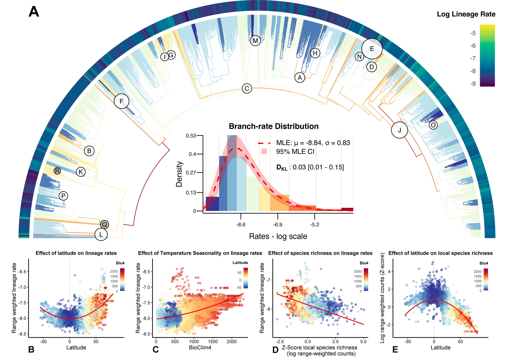
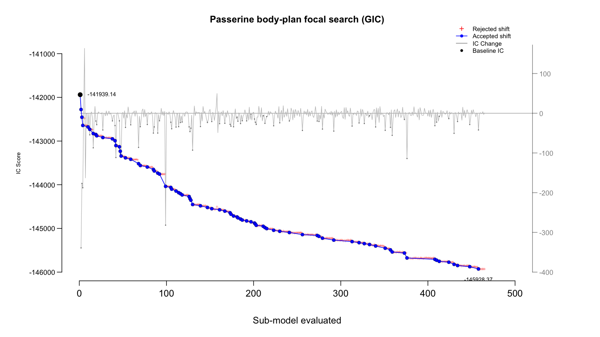

```{r, include = FALSE}
library(bifrost)
library(ape)

knitr::opts_chunk$set(
  collapse = TRUE,
  comment = "#>"
)

pkg_file <- function(...) {
  installed_path <- system.file(..., package = "bifrost")
  if (nzchar(installed_path)) {
    return(installed_path)
  }

  candidates <- c(
    file.path("inst", ...),
    file.path("..", "inst", ...)
  )

  for (path in candidates) {
    if (file.exists(path)) {
      return(path)
    }
  }

  stop("Could not locate: ", file.path(...))
}
```

## Introduction

This vignette walks through the primary temporal analysis from the passerine body-plan study that motivated the `bifrost` workflow. The example pairs a time-scaled passerine phylogeny with species-level skeletal measurements derived from the Skelevision pipeline and shows how to set up a multivariate shift search in which body mass is included as a phylogenetic covariate.

Relative to the jaw-shape vignette, this article highlights a second common `bifrost` use case: fitting a multivariate response while conditioning on an additional predictor. Here, the response is a 12-trait matrix of logged skeletal measurements and the predictor is logged body mass (`vertnet_mass`).

The full manuscript search is computationally intensive, so this vignette does **not** re-run it during package build. Instead, it does two things:

1. shows how to prepare and launch the focal analysis with the current `bifrost` API, and
2. shows how to inspect a precomputed manuscript-scale `bodyplan_search` object loaded from an external archive.

For this workflow, `bifrost` ships a 2,057-tip passerine tree plus a 13-column data matrix containing 12 skeletal measurements and `vertnet_mass`.

```{r bodyplan_fig1, echo=FALSE, fig.align="center", out.width="100%", fig.alt="Figure 1 from the passerine body plan manuscript, showing the focal phylogenetic rate-shift analysis and associated spatial summaries."}

```

```{r bodyplan_fig1_caption, echo=FALSE, results='asis'}
cat("> **Figure 1 from the passerine body-plan manuscript that motivated `bifrost`.** Panel A shows the focal temporal analysis on the passerine phylogeny; panels B-D summarize downstream spatial analyses built from the inferred lineage rates.\n")
```

## Setup

```{r load_packages, eval=FALSE}
library(bifrost)
library(ape)
```

## Data availability

The vignette uses packaged example inputs for the tree and trait matrix. If you want the complete manuscript archive, you can replace the placeholder links below with the final Zenodo record for the project:

- [Zenodo archive](https://zenodo.org/records/RECORD_ID)
- [Trait matrix (`dat.mvgls.RDS`)](https://zenodo.org/records/RECORD_ID/files/dat.mvgls.RDS?download=1)
- [Time-scaled tree (`ythlida_supertree.rescale.tre`)](https://zenodo.org/records/RECORD_ID/files/ythlida_supertree.rescale.tre?download=1)
- [Full focal run (`min10.ic20.gic.RDS`, ~1.2 GB)](https://zenodo.org/records/RECORD_ID/files/min10.ic20.gic.RDS?download=1)

## How this differs from the jaw-shape vignette

- The jaw-shape example fits an intercept-only model to GPA-aligned landmark coordinates.
- The passerine skeleton analysis fits 12 skeletal traits while including `vertnet_mass` as a covariate.
- The bird tree is much larger (2,057 tips instead of 86), so it is better treated as a precomputed manuscript-scale example than a vignette-scale re-run.

## Loading the packaged example

```{r load_data}
tree_path <- pkg_file("extdata", "avian-skeleton", "passerine_bodyplan_tree.tre")
trait_path <- pkg_file("extdata", "avian-skeleton", "passerine_bodyplan_data.RDS")

bird_tree <- read.tree(tree_path)
bodyplan_data <- readRDS(trait_path)

bird_tree <- reorder(bird_tree, order = "postorder")
stopifnot(setequal(rownames(bodyplan_data), bird_tree$tip.label))

bodyplan_data <- as.matrix(bodyplan_data[bird_tree$tip.label, , drop = FALSE])
skeletal_cols <- setdiff(colnames(bodyplan_data), "vertnet_mass")
bodyplan_data <- bodyplan_data[, c(skeletal_cols, "vertnet_mass"), drop = FALSE]
formula_str <- sprintf(
  "trait_data[, 1:%d] ~ trait_data[, %d]",
  length(skeletal_cols),
  ncol(bodyplan_data)
)

c(
  species = nrow(bodyplan_data),
  skeletal_traits = length(skeletal_cols),
  total_columns = ncol(bodyplan_data)
)
```

The packaged matrix is ordered so that the 12 skeletal traits come first and `vertnet_mass` comes last. That makes the model formula explicit:

```{r bodyplan_formula}
formula_str
```

## Running the focal analysis

The primary manuscript analysis used the `searchOptimalConfiguration()` call below. This is the clearest contrast with the jaw-shape vignette: we use a pGLS-style formula so that the 12 skeletal measurements are modeled jointly while conditioning on body mass.

```{r run_bodyplan_search, eval=FALSE}
# Optional for large runs on workstations or clusters
options(future.globals.maxSize = 20 * 1024^3)

set.seed(1)
bodyplan_search <- searchOptimalConfiguration(
  baseline_tree              = bird_tree,
  trait_data                 = bodyplan_data,
  formula                    = formula_str,
  min_descendant_tips        = 10,
  num_cores                  = 20,   # adjust to your machine
  shift_acceptance_threshold = 20,
  uncertaintyweights_par     = TRUE,
  IC                         = "GIC",
  plot                       = FALSE,
  method                     = "LL",
  error                      = TRUE,
  store_model_fit_history    = TRUE,
  verbose                    = TRUE
)
```

### Why these settings?

- `formula = trait_data[, 1:12] ~ trait_data[, 13]` treats the first 12 columns as the multivariate skeletal response and `vertnet_mass` as the size covariate.
- `min_descendant_tips = 10` and `shift_acceptance_threshold = 20` match the focal manuscript analysis and provide a conservative search over a large tree.
- `IC = "GIC"` follows the manuscript choice for high-dimensional comparative data.
- `method = "LL"` is appropriate here because the model includes a predictor; the jaw-shape vignette instead uses an intercept-only setup.
- `error = TRUE` estimates a nuisance measurement-error term, which is recommended for empirical datasets.

## Optional: load the archived focal run

If you prefer to inspect the complete focal manuscript result rather than re-run the search locally, you can load the archived `RDS` file and continue using the same `bodyplan_search`-based workflow shown below.

```{r load_archived_run, eval=FALSE}
zenodo_base <- "https://zenodo.org/records/RECORD_ID/files"
run_url <- sprintf("%s/min10.ic20.gic.RDS?download=1", zenodo_base)
cache_dir <- tools::R_user_dir("bifrost", which = "cache")
dir.create(cache_dir, recursive = TRUE, showWarnings = FALSE)

run_path <- file.path(cache_dir, "min10.ic20.gic.RDS")

if (!file.exists(run_path)) {
  download.file(run_url, destfile = run_path, mode = "wb", method = "libcurl")
}

bodyplan_search <- readRDS(run_path)

# Older manuscript objects may be stored as plain lists rather than
# as a bifrost_search S3 object.
if (!inherits(bodyplan_search, "bifrost_search")) {
  class(bodyplan_search) <- c("bifrost_search", class(bodyplan_search))
}
```

## Working with the returned object

The current `bifrost` API returns a `bifrost_search` object. The downstream examples below assume that `bodyplan_search` was created either by running `searchOptimalConfiguration()` or by loading the archived focal run shown above.

```{r inspect_returned_object, eval=FALSE}
# High-level print method
bodyplan_search

# Which information criterion was used?
bodyplan_search$IC_used

# Accepted shift locations
bodyplan_search$shift_nodes_no_uncertainty

# Information-criterion improvement over the baseline model
bodyplan_search$baseline_ic
bodyplan_search$optimal_ic
bodyplan_search$baseline_ic - bodyplan_search$optimal_ic

# Per-shift support values, if uncertaintyweights_par = TRUE
head(bodyplan_search$ic_weights)

# Regime-specific evolutionary variance-covariance matrices
names(bodyplan_search$VCVs)
```

## Visualizing the search history

`bifrost` records the IC trajectory across accepted and rejected candidates. Once a search has finished, you can visualize that path directly from the returned object:

```{r focal_acceptance_plot_code, eval=FALSE}
plot_ic_acceptance_matrix(
  matrix_data = bodyplan_search$model_fit_history$ic_acceptance_matrix,
  baseline_ic = bodyplan_search$baseline_ic,
  plot_title = "Passerine body-plan focal search (GIC)"
)
```

Because this vignette does not re-run the full manuscript-scale search during build, the panel below is a precomputed example of the exact plot generated by the API call above for the focal passerine analysis.

```{r focal_acceptance_plot_example, echo=FALSE, fig.align="center", out.width="100%", fig.alt="Precomputed example of the IC acceptance matrix plot for the focal passerine body-plan analysis."}

```

This acceptance trace is useful when comparing sensitivity analyses across different thresholds or minimum clade sizes.

## Next steps

Once you have a fitted `bifrost_search` object, the same downstream pattern from the jaw-shape vignette applies here:

1. inspect `shift_nodes_no_uncertainty` and `ic_weights`,
2. extract regime-specific VCV matrices from `VCVs`,
3. use the returned SIMMAP tree to summarize rates across clades or through time, and
4. merge those summaries with external ecological, geographic, or climatic datasets.

For the bird skeleton dataset, those downstream steps were used to connect inferred body-plan shifts to climatic instability through time and to contemporary spatial gradients in seasonality and latitude.
