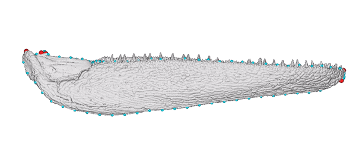
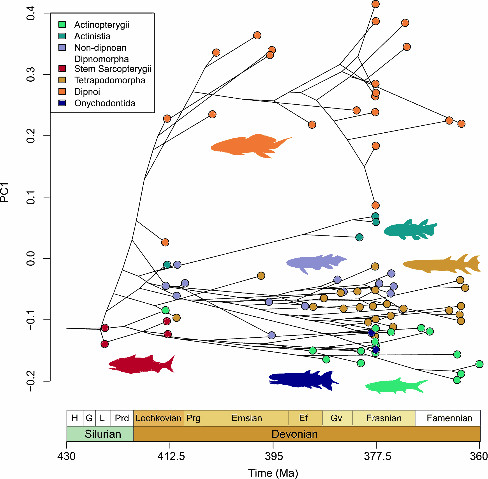
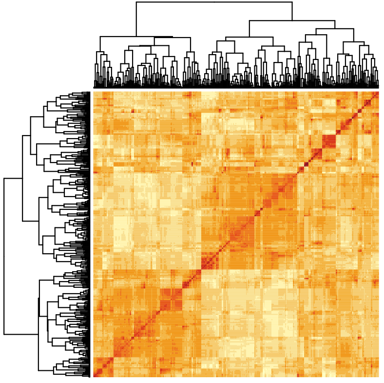
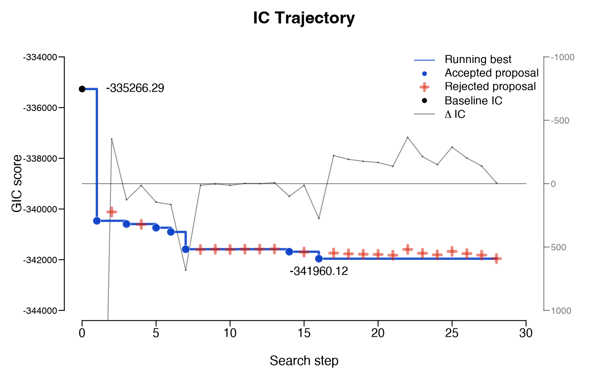

```{r, include = FALSE}
knitr::opts_chunk$set(
  collapse = TRUE,
  comment = "#>"
)
```
```{r, echo=FALSE, results='asis'}
cat("
<style>
/* Remove any default borders/shadows around vignette/pkgdown images */
img, .figure img, .figure > p > img {
  border: 0 !important;
  box-shadow: none !important;
  outline: none !important;
}
</style>
")
```

## Introduction 🐠

This vignette demonstrates the core functionality of the *`bifrost`* R package. *`bifrost`* is designed to identify and analyze cladogenic shifts in multivariate trait evolution. It is capable of analyzing morphological datasets comprising thousands of species, [without dimensionality reduction techniques like PCA](https://doi.org/10.1093/sysbio/syv019).

```{r jaw_gif_pkgdown, echo=FALSE, results='asis', eval=identical(Sys.getenv("IN_PKGDOWN"), "true")}
cat('
<p style="text-align:center">
  
</p>
')
```

```{r jaw_media_cran, echo=FALSE, fig.align="center", out.width="80%", fig.alt="Static frame of the jaw model; an animated GIF is shown on the package website.", eval = !identical(Sys.getenv("IN_PKGDOWN"), "true")}

```

```{r jaw_caption, echo=FALSE, results='asis'}
if (identical(Sys.getenv("IN_PKGDOWN"), "true")) {
  cat("> **Figure 1. Animated jaw model of *Gogosardina coatesi* (specimen NMV P228269).** ",
      "The 3D model is publicly available on [MorphoSource](https://www.morphosource.org/concern/media/000670517?locale=en). The landmark scheme used in subsequent analyses includes six fixed points (red) and five curves (blue).\n")
} else {
  cat("> **Figure 1. Static frame of the jaw model.** An animated version appears on the package website. ",
      "3D model of *Gogosardina coatesi* (specimen NMV P228269) is publicly available on ",
      "[MorphoSource](https://www.morphosource.org/concern/media/000670517?locale=en). The landmark scheme includes six fixed points (red) and five curves (blue).\n")
}
```

We will walk through an example using a fossil dataset from [Troyer et al. (2025)](https://doi.org/10.1016/j.cub.2025.08.008), which examines macroevolutionary patterns of jaw shape in the earliest radiation of bony fishes. *`bifrost`* assumes that the branch lengths of the input phylogeny are in units of time, and does not require ultrametric phylogenies.

```{r troyer_fig1, echo=FALSE, fig.align="center", out.width="60%", fig.alt="Figure from Troyer et al. (2025) showing contrasting jaw-shape space exploration among early bony fishes."}

```

```{r troyer_fig1_caption, echo=FALSE, results='asis'}
cat("> **Figure 2. Contrasting patterns of jaw-shape space exploration among early bony fishes.** Phylogenetic traitgram of the first principal component (PC1) of lower jaw shape in early osteichthyans (bony fishes), from Figure 1 of Troyer et al. (2025). Learn more about Emily's research [here](https://emilymtroyer.weebly.com/).\n")
```

[Troyer et al. (2025)](https://doi.org/10.1016/j.cub.2025.08.008) find that early lobe-finned fishes, such as lungfishes and coelacanths, displayed surprisingly high rates of jaw evolution and morphological diversity, while ray-finned fishes—a hyper-diverse group today—showed much slower rates. This "macroevolutionary role reversal" presents an interesting test-case for applying the *`bifrost`* R package to infer shifts in the tempo and mode of evolution across the phylogeny of early vertebrates.

We will use the primary function `searchOptimalConfiguration()` to perform a greedy, step-wise search to infer evolutionary regime shifts under multivariate Brownian motion.

## Setup

First, we load the *`bifrost`* package and other necessary libraries for data manipulation and visualization.

```{r load_packages, eval=FALSE}
library(bifrost)
library(ape)
library(phytools)
# geomorph is needed for two.d.array
# install.packages("geomorph") 
library(geomorph)
```

Let's load the data.

## Loading the Data

The dataset consists of two main components:

1.  A phylogenetic tree (`mrbayes_prune_tree.RDS`) for 86 species of Silurian-Devonian bony fishes.
2.  A 3D landmark dataset (`jaws_coords.RDS`) representing the 3D jaw shapes for each of these species.

These files are included with the package and are available at the publication's [data repository](https://datadryad.org/dataset/doi:10.5061/dryad.z08kprrqf). We can load them using `system.file()` to find the correct path within the package's installed directory.

```{r load_data, eval=FALSE}
# Define paths to the data files included in the package
tree_path <- system.file("extdata", "jaw-shape", "mrbayes_prune_tree.RDS", 
                         package = "bifrost")
landmark_path <- system.file("extdata", "jaw-shape", "jaws_coords.RDS", 
                             package = "bifrost")

# Load the phylogenetic tree and landmark data
fish.tree <- readRDS(tree_path)
landmarks <- readRDS(landmark_path)

# Ensure the tree is in the correct format (a phylo object, here we also 
# ladderize for downstream plotting)
fish.tree <- ladderize(untangle(as.phylo(fish.tree)))

# The raw landmark data is a 3D array (landmarks x dimensions x species) after 
# GPA (Generalized Procrustes analysis)
# We convert the 3D array into a 2D matrix for analysis using a function from 
# the geomorph package.
fish.data <- two.d.array(landmarks)

# It's crucial to ensure the order of species in the trait data matrix matches 
# the order of tip labels in the phylogenetic tree.
tip_order <- match(fish.tree$tip.label, rownames(fish.data))
fish.data <- fish.data[tip_order, ]

# Let's inspect our data
print(fish.tree)
str(fish.data)
```

## Running an example workflow

The core of the *`bifrost`* workflow is the `searchOptimalConfiguration()` function. This function automates the process of identifying the optimal placement of evolutionary regime shifts on the tree.

### Optional Runtime Setup

The next chunk is optional. It tweaks runtime behavior only: memory limits, live plotting, and the session-level BLAS/OpenMP thread cap used by sequential linear algebra. None of these choices changes the model or search logic.

```{r runtime_setup, eval=FALSE, message = TRUE}
# ---- Optional: increase future globals limit (needed for large objects) ----
options(future.globals.maxSize = 10 * 1024^3)

# ---- Optional: open a dedicated plotting device for live search plots ----
use_live_plot <- FALSE
if (interactive() && use_live_plot) {
  if (.Platform$OS.type == "windows") {
    windows()
  } else if (Sys.info()[["sysname"]] == "Darwin") {
    quartz()
  } else {
    x11()
  }
}

# ---- Optional: speed up SEQUENTIAL linear algebra via BLAS/OpenMP threads ----
# NOTE: bifrost caps BLAS/OpenMP threads to 1 inside its PARALLEL blocks to
# avoid oversubscription.
thread_vars <- c(
  "OMP_NUM_THREADS", "OPENBLAS_NUM_THREADS", "MKL_NUM_THREADS",
  "VECLIB_MAXIMUM_THREADS"
)
old_threads <- Sys.getenv(thread_vars, unset = NA_character_)

n_threads <- "4"  # must be a character string
Sys.setenv(
  OMP_NUM_THREADS        = n_threads,
  OPENBLAS_NUM_THREADS   = n_threads,
  MKL_NUM_THREADS        = n_threads,
  VECLIB_MAXIMUM_THREADS = n_threads
)
```

### The Function Call

Here is the function call we will use for this analysis. We'll break down each parameter choice below.

```{r run_bifrost_setup, eval=FALSE, message = TRUE}
if (!exists("use_live_plot", inherits = TRUE)) {
  use_live_plot <- FALSE
}

# ---- Run the search ----
set.seed(1)
jaws_search <- searchOptimalConfiguration(
  baseline_tree              = fish.tree,
  trait_data                 = fish.data,
  min_descendant_tips        = 10, # try 4 for higher resolution (but more CPU time)
  num_cores                  = 4,
  shift_acceptance_threshold = 20,
  uncertaintyweights_par     = TRUE,
  IC                         = "GIC",
  plot                       = use_live_plot,
  formula                    = "trait_data ~ 1",
  method                     = "H&L", # penalized likelihood for high-dimensional data
  error                      = TRUE,
  store_model_fit_history    = TRUE,
  verbose                    = TRUE
)

# Restore environment variables if the optional thread block above was run
if (exists("old_threads", inherits = FALSE)) {
  for (nm in names(old_threads)) {
    val <- old_threads[[nm]]
    if (is.na(val) || val == "") {
      Sys.unsetenv(nm)
    } else {
      do.call(Sys.setenv, setNames(list(val), nm))
    }
  }
}
```

### Understanding the primary input options

The table below gives a quick reference for the main choices made in this function call. The notes that follow focus on the rationale and caveats behind the less self-explanatory options.

| Option | Value here | What it controls |
|:--|:--|:--|
| `baseline_tree` | `fish.tree` | The starting phylogeny and single-regime null model |
| `trait_data` | `fish.data` | The multivariate trait matrix analyzed by the model |
| `min_descendant_tips` | `10` | The minimum clade size considered for candidate shifts |
| `num_cores` | `4` | The number of CPU cores used to evaluate candidate shift models in parallel |
| `shift_acceptance_threshold` | `20` | The IC improvement required to accept a new shift |
| `uncertaintyweights_par` | `TRUE` | Whether to estimate post-hoc support for accepted shifts in parallel |
| `IC` | `"GIC"` | The information criterion used to compare candidate models |
| `plot` | `use_live_plot` (`FALSE` here) | Whether to plot accepted shifts during the search |
| `formula` | `"trait_data ~ 1"` | The multivariate GLS model structure |
| `method` | `"H&L"` | The `mvMORPH::mvgls` fitting method |
| `error` | `TRUE` | Whether to estimate and include measurement error |
| `store_model_fit_history` | `TRUE` | Whether to write per-iteration model fits to temporary storage |
| `verbose` | `TRUE` | Whether to print progress messages via `message()` as candidates are generated and evaluated |

Some choices deserve additional context:

  * `baseline_tree = fish.tree`: Internally, all branches start in a single baseline regime (labeled "0"). The function searches for shifts *away* from this null model.
  
  * `trait_data = fish.data`: These are the high-dimensional jaw shape coordinates modeled as the multivariate response.
  
  * `min_descendant_tips = 10`: This user-defined constraint limits candidate shifts to internal nodes leading to at least 10 species. It helps reduce overfitting by preventing shifts on very small clades. We use 10 here, but the optimal choice depends on the dataset (~10 is recommended for large trees).

  * `num_cores = 4`: When `num_cores > 1`, *`bifrost`* uses `future` workers for parallel candidate scoring and parallel IC-weight calculations. Only those future-based parallel blocks temporarily cap BLAS/OpenMP threads to 1 per worker to avoid CPU oversubscription, then restore the previous settings. Sequential `mvgls` stages, such as the baseline fit and later greedy-search refits, use the BLAS/OpenMP settings already active in the R session; set those outside the search call if you want a higher cap for sequential linear algebra.
  
  * `shift_acceptance_threshold = 20`: This is the core of the greedy algorithm. A potential shift is accepted only if it improves fit by at least 20 IC units (GIC units here), reducing the risk of spurious shifts.
  
  * `uncertaintyweights_par = TRUE`: After the greedy search identifies an optimal shift configuration, the final model is refit repeatedly with each accepted shift removed in turn. The resulting IC weights quantify support for individual shifts in the context of the final model. The `_par` suffix indicates that this step is done in parallel.
  
  * `IC = "GIC"`: The **Generalized Information Criterion** is generally preferred for high-dimensional data (like our landmark data) compared to alternatives like AIC or BIC.
    
  * `plot = use_live_plot`: Real-time plotting can be useful for small tests because it shows the tree and labels shifts as they are accepted, but it slows down larger searches. Here `use_live_plot` defaults to `FALSE`.
  
  * `formula = "trait_data ~ 1"`: The intercept-only model (`~ 1`) corresponds to a multi-rate Brownian Motion process where each regime has its own rate matrix. The GPA-aligned morphometric coordinates are already size and rotation adjusted, so no additional size term is needed here. For linear dimensions or other predictors, you can use formulas that reference subsets of `trait_data`, for example `"trait_data[, 1:5] ~ 1"` to treat columns 1–5 as the multivariate response, or `"trait_data[, 2:ncol(trait_data)] ~ trait_data[, 1]"` if the first column is log-mass and the remaining columns are logged linear dimensions.
  
  * `method = "H&L"`: H\&L is a fast, approximated leave-one-out cross-validation (LOOCV) approach based on Hoffbeck and Landgrebe (1996). It is effective for intercept-only models with a "RidgeArch" default penalty, making it a reasonable choice for this high-dimensional dataset. Other options passed to `mvgls` will depend on the nature of the input dataset.
  
  * `error = TRUE`: `mvgls` estimates a measurement-error (intra-specific variance) term and incorporates it into the model. Even without explicit measurement-error values, the function treats this variance as an additional parameter, which is recommended for empirical datasets with within-species variation.

  * `store_model_fit_history = TRUE`: Write per-iteration model fits to a temporary directory (`tempdir()`) during the search to avoid inflating memory usage while computation is ongoing; the full model-fit history is read back into memory at the end of the search.

## Interpreting the Output

The static figures in this vignette use the same jaw-shape search settings shown above. For the cached threshold-20 run used here, the selected model retained 17 shifts and improved the GIC by more than 7,000 units relative to the single-regime baseline.

| Result | Value |
|:--|:--|
| Accepted shifts | 17 |
| Accepted shift nodes | 107, 113, 115, 94, 128, 129, 158, 157, 98, 161, 92, 89, 93, 96, 97, 108, 116 |
| Baseline GIC | -335266.29 |
| Optimal GIC | -342739.42 |
| GIC improvement (`baseline_ic - optimal_ic`) | 7473.13 |

The `searchOptimalConfiguration()` result is a named list. These are the main components to inspect first:

| Component | Interpretation |
|:--|:--|
| `shift_nodes_no_uncertainty` | Integer node numbers where shifts were accepted in the selected no-uncertainty configuration |
| `baseline_ic` and `optimal_ic` | GIC scores for the single-regime baseline and selected multi-regime model; lower IC is better |
| `VCVs` | Regime-specific variance-covariance matrices, including the baseline regime `"0"` |
| `ic_weights` | Drop-one support values for individual shifts when `uncertaintyweights_par = TRUE` |
| `model_fit_history` | Per-iteration model fits used by `icTrajectory()` to diagnose search behavior |

```{r print_method_demo, eval=FALSE}
# The bifrost_search object has a custom S3 print method:
# typing the object shows a summary.
jaws_search
```

Let's look at the key components programmatically:

```{r interpret_results, eval=FALSE}
# The node numbers where shifts were inferred and accepted
print(jaws_search$shift_nodes_no_uncertainty)

# The final, optimal IC score compared to the baseline
cat("Baseline GIC:", jaws_search$baseline_ic, "\n")
cat("Optimal GIC:", jaws_search$optimal_ic, "\n")
cat("Improvement (Delta GIC):", jaws_search$baseline_ic - jaws_search$optimal_ic, "\n")

# The VCV matrices for each detected regime
# This shows the estimated rates of evolution for each regime
# The root state is always assigned to `0`
heatmap(jaws_search$VCVs$`0`, labRow = "", labCol = "")

# We can also visualize/extract the estimated evolutionary correlations across 
# traits (for the 'root' regime)
heatmap(cov2cor(jaws_search$VCVs$`0`), labRow = "", labCol = "")

# The ic_weights sub-object stores detailed information about shift support
# if uncertaintyweights_par = TRUE.
print(as.matrix(jaws_search$ic_weights))

# Extract the strongest-supported shift nodes and corresponding IC weights
support <- jaws_search$ic_weights[order(
  jaws_search$ic_weights$ic_weight_withshift,
  decreasing = TRUE
), c("node", "ic_weight_withshift")]
print(head(support, 10))

# Extract the nodes with weights > 95%
print(with(jaws_search$ic_weights, {
  sel <- ic_weight_withshift > 0.95
  cbind(node = node[sel], weight = ic_weight_withshift[sel])
}))
```

```{r cor_heatmap_fig, echo=FALSE, fig.align="center", out.width="60%", fig.alt="Heatmap of estimated evolutionary correlations for the root regime in the jaw-shape example."}

```

> **Figure 3. Estimated evolutionary correlations for the root regime.** Heatmap of estimated evolutionary correlations (computed as ``cov2cor(jaws_search$VCVs$`0`)``) among jaw-shape traits for the root regime inferred in the example analysis. Rows and columns are ordered by hierarchical clustering, and blocks of high correlation along the diagonal may indicate modular patterns of trait evolution.

## Inspecting the search behavior

```{r plot_decay, eval=FALSE}
# Since we saved the model search history 

# We can inspect the behavior of the search with an IC trajectory.
plot(
  icTrajectory(jaws_search),
  delta_limits = c(1000, -1000),
  scales = c(point = 1.30, line = 1.25, text = 1.15),
  point_sizes = c(accepted = 1.82, rejected = 1.30),
  line_widths = c(running_best = 2.52, rejected = 3.17),
  text_sizes = c(
    main = 1.73,
    x_axis = 1.22,
    axis_label = 1.34,
    y_axis = 0.94,
    delta_axis = 0.94,
    annotation = 1.20,
    legend = 1.15
  ),
  annotation = c(baseline_label_offset = 2.05)
)

```

```{r IC_decay_fig, echo=FALSE, fig.align="center", out.width="80%", fig.alt="Information-criterion trajectory across sequentially evaluated sub-models. Accepted shifts are shown as blue points, rejected shifts as red crosses, the running best IC as a blue step line, and the baseline IC as a black point. Proposal-level delta IC is also shown."}

```

> **Figure 4. Information-criterion trajectory for the jaw-shape search.** Information-criterion (IC) trajectory across sequentially evaluated sub-models during the greedy shift search. Blue points indicate accepted shifts, red crosses indicate rejected shifts, the blue step line tracks the running best IC, and the black point marks the baseline IC. The plot also shows proposal-level delta IC. Labels highlight the baseline and minimum accepted IC values.

## Generating a branch-rate plot

```{r plot_tree, eval=FALSE}

# Mean branch-rate colors (viridis): dark purple = slow, yellow = fast
cols  <- generateViridisColorScale(jaws_search$model_no_uncertainty$param)$NamedColors
rates <- jaws_search$model_no_uncertainty$param[names(cols)]

plotSimmap(
  jaws_search$tree_no_uncertainty_untransformed,
  ftype = "off",
  direction = "upwards",
  colors = cols
)

# ---- Continuous color bar (bottom-left, inside plot region) ----
op <- par(xpd = NA); on.exit(par(op), add = TRUE)
usr <- par("usr"); xr <- diff(usr[1:2]); yr <- diff(usr[3:4])

# Geometry (fractions of plot range)
x0 <- usr[1] + 0.05 * xr
x1 <- x0 + 0.70 * (0.30 * xr)
y0 <- usr[3] + 0.06 * yr
y1 <- y0 + 0.512 * (0.06 * yr)

vscale <- 0.64
cols_ord <- cols[order(rates)]
xs <- seq(x0, x1, length.out = length(cols_ord) + 1L)

rect(xs[-length(xs)], y0, xs[-1], y1, col = cols_ord, border = NA)
rect(x0, y0, x1, y1, border = "grey30")

text((x0 + x1) / 2, y1 + vscale * (0.03 * yr), 
     "Mean rate (slow \u2192 fast)", cex = 0.9)
```

```{r branch_rates_fig, echo=FALSE, fig.align="center", out.width="80%", fig.alt="Upward-oriented phylogenetic tree without tip labels. Branches are colored using a viridis gradient, where yellow branches represent faster inferred evolutionary rates and dark purple branches represent slower rates; different clades show distinct colors indicating variation in branch rates across the tree."}
knitr::include_graphics("jaw-shape/branch_rates.png")
```

> **Figure 5. Branch-rate visualization for the jaw-shape example.** SIMMAP-style phylogeny object from the jaw-shape example, with branches colored by inferred mean evolutionary rate under the selected multi-regime model. Branch colors follow a perceptually uniform viridis scale, with yellow indicating faster rates and dark purple indicating slower rates, highlighting variation in evolutionary tempo across the tree. Faster branches on the left side correspond to Dipnoi -- or lungfish; see Troyer et al. (2025).

## Conclusion

This vignette demonstrates how to use the *`bifrost`* package to analyze a complex, high-dimensional dataset to find significant shifts in evolutionary dynamics. Applying `searchOptimalConfiguration()` to a Paleozoic fish jaw dataset, we infer cladogenic events that correspond with significant shifts in multivariate phenotypic evolution, similar to the hypotheses presented in Troyer et al. (2025). This workflow allows us not only to identify *where* shifts occurred but also to quantify the *magnitude* of the change in evolutionary rates through the VCV matrices. For a deeper look at branch-rate summaries and threshold sensitivity in this same dataset, continue to the [rate-map jaw-shape vignette](rate-map-jaw-shape-vignette.html).
