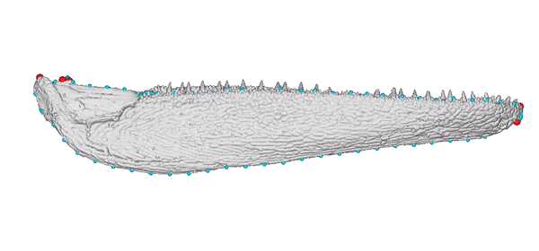
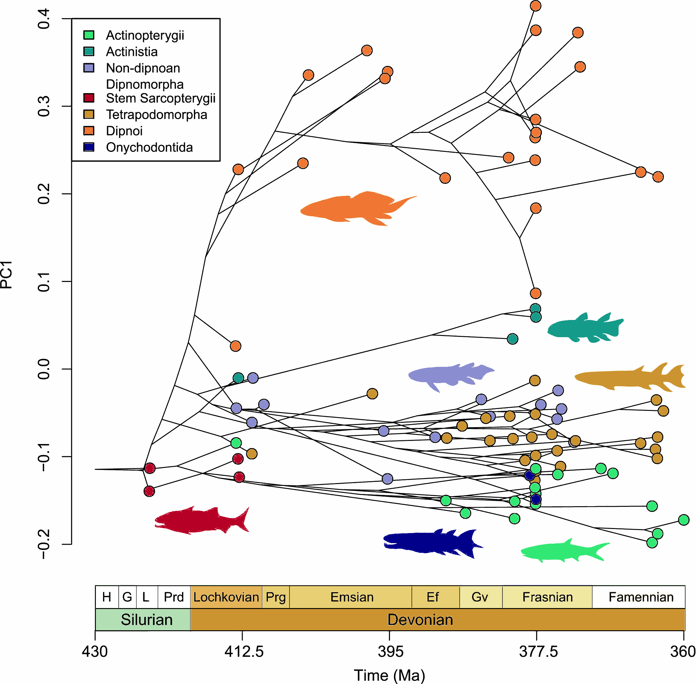

```{r, include = FALSE}
knitr::opts_chunk$set(
  collapse = TRUE,
  comment = "#>"
)
```
```{r, echo=FALSE, results='asis'}
cat("
<style>
/* Remove any default borders/shadows around vignette/pkgdown images */
img, .figure img, .figure > p > img {
  border: 0 !important;
  box-shadow: none !important;
  outline: none !important;
}
</style>
")
```

## Introduction 🐠

This vignette demonstrates the core functionality of the `bifrost` R package. `bifrost` is designed to identify and analyze cladogenic shifts in multivariate trait evolution. It is capable of analyzing morphological datasets comprising thousands of species, [without dimensionality reduction techniques like PCA](https://doi.org/10.1093/sysbio/syv019).

```{r jaw_gif_pkgdown, echo=FALSE, results='asis', eval=identical(Sys.getenv("IN_PKGDOWN"), "true")}
cat('
<p style="text-align:center">
  
</p>
')
```

```{r jaw_media_cran, echo=FALSE, fig.align="center", out.width="80%", fig.alt="Static frame of the jaw model; an animated GIF is shown on the package website.", eval = !identical(Sys.getenv("IN_PKGDOWN"), "true")}

```

```{r jaw_caption, echo=FALSE, results='asis'}
if (identical(Sys.getenv("IN_PKGDOWN"), "true")) {
  cat("> **Animated jaw model of *Gogosardina coatesi* (specimen NMV P228269).**  \n",
      "> The 3D model is publicly available on [MorphoSource](https://www.morphosource.org/concern/media/000670517?locale=en). The landmark scheme used in subsequent analyses includes six fixed points (red) and five curves (blue).\n")
} else {
  cat("> **Static frame shown here.** An animated version appears on the package website.  \n",
      "> 3D model of *Gogosardina coatesi* (specimen NMV P228269) is publicly available on ",
      "[MorphoSource](https://www.morphosource.org/concern/media/000670517?locale=en). The landmark scheme includes six fixed points (red) and five curves (blue).\n")
}
```

We will walk through an example using a fossil dataset from [Troyer et al. (2025)](https://doi.org/10.1016/j.cub.2025.08.008), which examines macroevolutionary patterns of jaw shape in the earliest radiation of bony fishes. `bifrost` assumes that the branch lengths of the input phylogeny are in units of time, and does not require ultrametric phylogenies.

```{r troyer_fig1, echo=FALSE, fig.align="center", out.width="80%", fig.alt="Figure 1 from Troyer et al. (2025)."}

```

```{r troyer_fig1_caption, echo=FALSE, results='asis'}
cat("> **Figure 1 from Troyer et al. 2025: Contrasting patterns of jaw-shape space exploration among early bony fishes.** Phylogenetic traitgram of the first principal component (PC1) of lower jaw shape in early osteichthyans (bony fishes). Learn more about Emily's research [here](https://emilymtroyer.weebly.com/).\n")
```

[Troyer et al. (2025)](https://doi.org/10.1016/j.cub.2025.08.008) find that early lobe-finned fishes, such as lungfishes and coelacanths, displayed surprisingly high rates of jaw evolution and morphological diversity, while ray-finned fishes—a hyper-diverse group today—showed much slower rates. This "macroevolutionary role reversal" presents an interesting test-case for applying the `bifrost` R package to infer shifts in the tempo and mode of evolution across the phylogeny of early vertebrates.

We will use the primary function `searchOptimalConfiguration()` to perform a greedy, step-wise search to infer evolutionary regime shifts under multivariate Brownian motion.

## Setup

First, we load the `bifrost` package and other necessary libraries for data manipulation and visualization.

```{r load_packages, eval=FALSE}
library(bifrost)
library(ape)
library(phytools)
# geomorph is needed for two.d.array
# install.packages("geomorph") 
library(geomorph)
```

Let's load the data.

## Loading the Data

The dataset consists of two main components:

1.  A phylogenetic tree (`mrbayes_prune_tree.RDS`) for 86 species of Silurian-Devonian bony fishes.
2.  A 3D landmark dataset (`jaws_coords.RDS`) representing the 3D jaw shapes for each of these species.

These files are included with the package and are available at the publication's [data repository](https://datadryad.org/dataset/doi:10.5061/dryad.z08kprrqf). We can load them using `system.file()` to find the correct path within the package's installed directory.

```{r load_data, eval=FALSE}
# Define paths to the data files included in the package
tree_path <- system.file("extdata", "jaw-shape", "mrbayes_prune_tree.RDS", package = "bifrost")
landmark_path <- system.file("extdata", "jaw-shape", "jaws_coords.RDS", package = "bifrost")

# Load the phylogenetic tree and landmark data
fish.tree <- readRDS(tree_path)
landmarks <- readRDS(landmark_path)

# Ensure the tree is in the correct format (a phylo object, here we also ladderize for downstream plotting)
fish.tree <- ladderize(untangle(as.phylo(fish.tree)))

# The raw landmark data is a 3D array (landmarks x dimensions x species) after GPA (Generalized Procrustes analysis)
# We convert the 3D array into a 2D matrix for analysis using a function from the geomorph package.
fish.data <- two.d.array(landmarks)

# It's crucial to ensure the order of species in the trait data matrix matches the order of tip labels in the phylogenetic tree.
tip_order <- match(fish.tree$tip.label, rownames(fish.data))
fish.data <- fish.data[tip_order, ]

# Let's inspect our data
print(fish.tree)
str(fish.data)
```

## Running an example workflow

The core of the `bifrost` workflow is the `searchOptimalConfiguration()` function. This function automates the process of identifying the optimal placement of evolutionary regime shifts on the tree.

### The Function Call

Here is the function call we will use for this analysis. We'll break down each parameter choice below.

  * Optional: tweaks runtime/performance/plotting behavior (memory limit, interactive plotting device, BLAS/OpenMP thread env vars) and doesn’t change the model/search logic itself—so you can omit it if your defaults are fine or you’re running non-interactively / on a managed environment.

```{r run_bifrost_setup, eval=FALSE, message = TRUE}
# ---- Optional: increase future globals limit (needed for large objects) ----
options(future.globals.maxSize = 10 * 1024^3)

# ---- Optional: open a dedicated plotting device when running interactively ----
# (You can skip this entirely if plot = FALSE)
if (interactive()) {
  if (.Platform$OS.type == "windows") {
    windows()
  } else if (Sys.info()[["sysname"]] == "Darwin") {
    quartz()
  } else {
    x11()
  }
}

# ---- Optional: speed up SEQUENTIAL linear algebra via BLAS/OpenMP threads ----
# NOTE: bifrost caps BLAS/OpenMP threads to 1 *inside* its PARALLEL blocks to avoid oversubscription.
{thread_vars <- c("OMP_NUM_THREADS","OPENBLAS_NUM_THREADS","MKL_NUM_THREADS","VECLIB_MAXIMUM_THREADS")
old_threads <- Sys.getenv(thread_vars, unset = NA_character_)

n_threads <- "4"  # must be a character string
Sys.setenv(
  OMP_NUM_THREADS        = n_threads,
  OPENBLAS_NUM_THREADS   = n_threads,
  MKL_NUM_THREADS        = n_threads,
  VECLIB_MAXIMUM_THREADS = n_threads
)
}

# ---- Run the search ----
set.seed(1)
jaws_search <- searchOptimalConfiguration(
  baseline_tree              = fish.tree,
  trait_data                 = fish.data,
  min_descendant_tips        = 10,
  num_cores                  = 4,
  shift_acceptance_threshold = 20,
  uncertaintyweights_par     = TRUE,
  IC                         = "GIC",
  plot                       = FALSE,
  formula                    = "trait_data ~ 1",
  method                     = "H&L",   # penalized likelihood for high-dimensional data
  error                      = TRUE,
  store_model_fit_history    = TRUE,
  verbose                    = TRUE
)

# Restore environment variables
on.exit({
  for (nm in names(old_threads)) {
    val <- old_threads[[nm]]
    if (is.na(val) || val == "") {
      Sys.unsetenv(nm)
    } else {
      do.call(Sys.setenv, setNames(list(val), nm))
    }
  }
}, add = TRUE)

```

### Understanding the primary input options

Let's explore the choices made in this function call:

  * `baseline_tree = fish.tree`: This is our starting point—a phylogenetic tree. Internally, all branches are assigned to a single, baseline regime (labeled "0"). The function will search for shifts *away* from this null model.
  
  * `trait_data = fish.data`: This is the matrix of our high-dimensional jaw shape data. The function will model the evolution of these traits.
  
  * `min_descendant_tips = 10`: This is a user defined constraint. It tells the function to only consider potential shifts on internal nodes that lead to a clade with at least 10 species. This seeks to reduce overfitting by preventing shifts on very small clades. We use 10 in this example, but the optimal choice here will depend on a given dataset.
  
  * `num_cores = 4`: To speed up the search, the function evaluates all candidate shift models in parallel. We've specified using 4 CPU cores for this task.
  
  * `shift_acceptance_threshold = 20`: This is the core of the greedy algorithm. A potential new shift is only accepted if it improves the model fit by at least 20 IC units (in this case, GIC units). This conservative threshold is chosen to ensure that only shifts with very strong support are added to the model, reducing the risk of spurious shifts.
  
  * `uncertaintyweights_par = TRUE`: After the greedy search identifies an optimal configuration of shifts, this option triggers a post-hoc analysis to quantify the importance of each accepted shift. It refits the final model repeatedly, each time with a focal shift removed, and calculates an Information Criterion (IC) weight for each shift. This helps assess how much evidence supports each individual shift in the context of the final model. The `_par` suffix indicates this will be done in parallel.
  
  * `IC = "GIC"`: We have chosen the **Generalized Information Criterion** to evaluate model fit. GIC is generally preferred for high-dimensional data (like our landmark data) compared to alternatives like AIC or BIC.
    
  * `plot = FALSE`: This is a helpful option for visualizing the search in real-time. The function will plot the tree and label the shifts as they are accepted, but this will potentially slow down the search.
  
  * `formula = "trait_data ~ 1"`: This specifies the structure of the underlying GLS model. Here, we fit a simple intercept-only model (`~ 1`), which corresponds to a multi-rate Brownian Motion process where each regime has its own rate matrix. Morphometric coordinates that have been GPA aligned are size and rotation adjusted, so no size adjustment is required. For linear dimensions or other predictors, you can use more general formulas that reference subsets of `trait_data`, for example `"trait_data[, 1:5] ~ 1"` to treat columns 1–5 as the multivariate response, or `"trait_data[, 2:ncol(trait_data)] ~ trait_data[, 1]"` if the first column is log-mass and the remaining columns are logged linear dimensions.
  
  * `method = 'H&L'`: This specifies the likelihood fitting method passed to `mvMORPH::mvgls`. 'H\&L' is a fast, approximated leave-one-out cross-validation (LOOCV) approach based on the work of Hoffbeck and Landgrebe (1996). It is particularly effective for intercept-only models with a "RidgeArch" penalty, making it a good choice for this high-dimensional dataset. Other options passed to `mvgls` will depend on the nature of the input dataset.
  
  * `error = TRUE`: This argument tells `mvgls` to estimate a measurement-error (intra-specific variance) term from the data and incorporate it into the model. Even if no explicit measurement-error values are provided, the function will treat this variance as an additional parameter to estimate. This is recommended for empirical datasets to account for within-species variation.

  * `store_model_fit_history = TRUE`: Write per-iteration model fits to a temporary directory (`tempdir()`) during the search to avoid inflating memory usage while computation is ongoing; the full model-fit history is read back into memory at the end of the search.

  * `verbose = TRUE`: Print progress messages (via `message()`) as candidate models are generated and evaluated.

## Interpreting the Output

The `searchOptimalConfiguration` function returns a list containing detailed results of the search.

```{r print_method_demo, eval=FALSE}
# The bifrost_search object has a custom S3 print method:
# typing the object shows a summary.
jaws_search
```

Let's look at the key components:

```{r interpret_results, eval=FALSE}

# View the output of the results object

# The node numbers where shifts were inferred and accepted
print(jaws_search$shift_nodes_no_uncertainty)

# The final, optimal IC score compared to the baseline
cat("Baseline GIC:", jaws_search$baseline_ic, "\n")
cat("Optimal GIC:", jaws_search$optimal_ic, "\n")
cat("Improvement (Delta GIC):", jaws_search$baseline_ic - jaws_search$optimal_ic, "\n")

#The model fit improvement is > 7000 GIC units

# The VCV matrices for each detected regime
# This shows the estimated rates of evolution for each regime
# The root state is always assigned to `0`
heatmap(jaws_search$VCVs$`0`)

# We can also visualize/extract the estimated evolutionary correlations across traits
heatmap(cov2cor(jaws_search$VCVs$`0`))

# The ic_weights sub-object stores detailed information about shift support (if uncertaintyweights_par = TRUE)
print(jaws_search$ic_weights)

# Extract the shift node numbers with corresponding IC weights
print(cbind(node=jaws_search$ic_weights$node, weight=jaws_search$ic_weights$ic_weight_withshift))

# Extract the nodes with weights > 95%
print(with(jaws_search$ic_weights, {
  sel <- ic_weight_withshift > 0.95
  cbind(node = node[sel], weight = ic_weight_withshift[sel])
}))

# These nodes have very strong statistical support for shift events

```

## Inspecting the search behavior

```{r plot_decay, eval=FALSE}
# Since we saved the model search history 
# We can inspect the behavior of the search with this helper function 
plot_ic_acceptance_matrix(matrix_data = jaws_search$model_fit_history$ic_acceptance_matrix)

```

## Generating a preliminary branch-rate plot

```{r plot_tree, eval=FALSE}

#We use the provided helper function generateViridisColorScale to assign colors from the perceptually uniform viridis palette to the parameter values representing 'mean' branch-rates. This generates 'rate' categories that go from slow to fast.

plotSimmap(
  jaws_search$tree_no_uncertainty_untransformed,
  ftype='off',
  direction='upwards',
  colors = generateViridisColorScale(jaws_search$model_no_uncertainty$param)$NamedColors
)

#Vignette will be updated with additional plotting functions and post-hoc analyses

```


## Other key output

  * `shift_nodes_no_uncertainty`: A vector of integer node numbers on the phylogeny where significant shifts in jaw shape evolution were detected.
  
  * `optimal_ic` and `baseline_ic`: These values show the GIC score for the final multi-regime model and the initial single-regime model, respectively. The difference represents the total improvement in model fit achieved by adding the shifts.
  
  * `VCVs`: A list of variance-covariance matrices, one for each detected regime (including the baseline "0" regime). The elements of these matrices represent the evolutionary rates and covariances for the jaw shape traits. By comparing the matrices (e.g., by looking at their trace), we can quantify *how much faster* evolution was in one regime compared to another.
  
  * `ic_weights`: A dataframe showing the evidence supporting each individual shift. Higher weights (closer to 1.0) indicate that a given shift is essential for the overall model's explanatory power.


## Conclusion

This vignette demonstrates how to use the `bifrost` package to analyze a complex, high-dimensional dataset to find significant shifts in evolutionary dynamics. Applying `searchOptimalConfiguration` to a Paleozoic fish jaw dataset, we infer cladogenic events that correspond with significant shifts in  multivariate phenotypic evolution, similar to the hypotheses presented in Troyer et al. (2025). This workflow allows us not only to identify *where* shifts occurred but also to quantify the *magnitude* of the change in evolutionary rates through the VCV matrices (the topic of a separate vignette).
