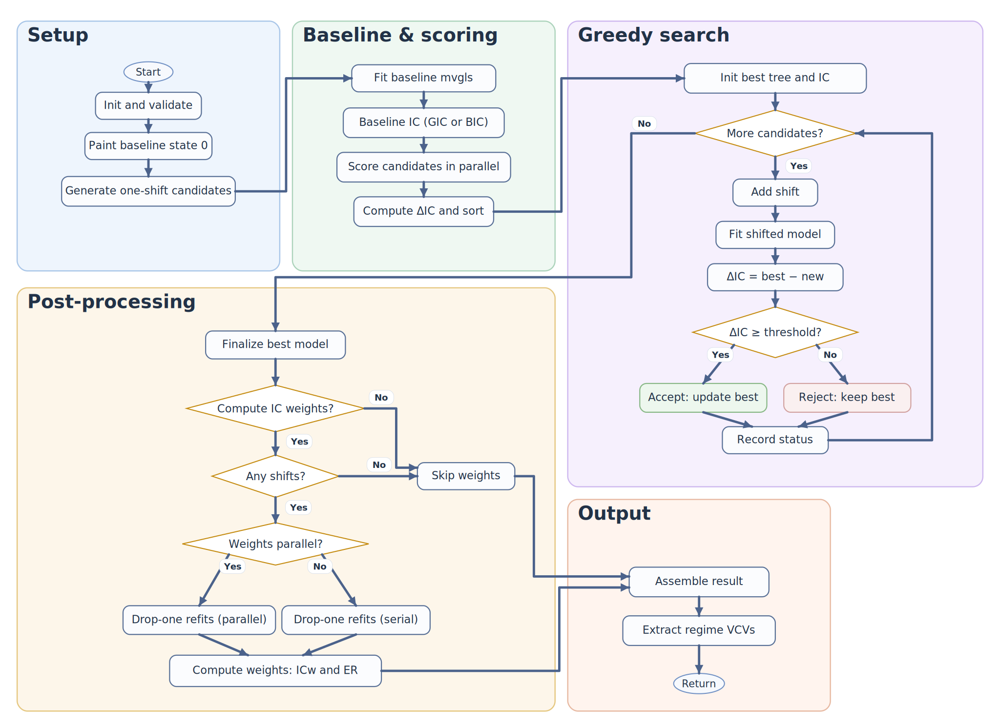

```{r, include = FALSE}
knitr::opts_chunk$set(
  collapse = TRUE,
  comment = "#>",
  eval = FALSE
)
```

## Overview

`bifrost` performs branch-level inference of multi-regime, multivariate trait evolution on a phylogeny using [penalized-likelihood multivariate GLS fits](https://doi.org/10.1093/sysbio/syy045). The current implementation searches for evolutionary model shifts under a multi-rate Brownian Motion (BMM) model with proportional regime variance-covariance (VCV) scaling. It operates directly in trait space, works with fossil tip-dated trees, and is designed for high-dimensional datasets (`p > n`) and large trees (`> 1000` tips).

If you have not installed the package yet, see the installation instructions on the [package README](https://github.com/jakeberv/bifrost).

In practical terms, `bifrost` asks:

- **Where** on the tree are shifts supported?
- **When** do those shifts occur?
- **How** does covariance and rate structure differ across inferred regimes?

## Minimal worked example

The smallest end-to-end workflow is a simulated single-regime example. Running it is mainly a quick way to confirm that `bifrost` and its dependencies are installed correctly and that the core search routine runs on your machine. In this case, we typically expect `bifrost` to recover no shifts.

```{r}
library(bifrost)
library(ape)
library(phytools)
library(mvMORPH)

set.seed(1)

# Simulate a tree
tr <- pbtree(n = 50, scale = 1)

# Simulate multivariate traits under a single-regime BM1 model (no shifts)
sigma <- diag(0.1, 2)  # 2 x 2 variance-covariance matrix for two traits
theta <- c(0, 0)       # ancestral means for the two traits

sim <- mvSIM(
  tree  = tr,
  nsim  = 1,
  model = "BM1",
  param = list(
    ntraits = 2,
    sigma   = sigma,
    theta   = theta
  )
)

# mvSIM returns either a matrix or a list of matrices depending on mvMORPH version
X <- if (is.list(sim)) sim[[1]] else sim
rownames(X) <- tr$tip.label

# Run bifrost's greedy search for shifts
res <- searchOptimalConfiguration(
  baseline_tree              = tr,
  trait_data                 = X,
  formula                    = "trait_data ~ 1",
  min_descendant_tips        = 10,
  num_cores                  = 1,
  shift_acceptance_threshold = 20,  # conservative GIC threshold
  IC                         = "GIC",
  plot                       = FALSE,
  store_model_fit_history    = FALSE,
  verbose                    = FALSE
)

# For this single-regime BM1 simulation, we typically expect no inferred shifts
res$shift_nodes_no_uncertainty
res$optimal_ic - res$baseline_ic
str(res$VCVs)
```

What to expect from this example:

- `res$shift_nodes_no_uncertainty` is typically `integer(0)`,
- `res$optimal_ic - res$baseline_ic` is typically close to `0`,
- `res$VCVs` contains a single regime-specific VCV for the baseline regime `"0"`.

## Before you run on real data

At minimum, provide:

1. A rooted phylogeny with branch lengths interpreted in units of time.
2. A multivariate trait matrix or data frame with taxa as row names.

Important checks before fitting:

- **Tree and data alignment.** `rownames(trait_data)` must match `tree$tip.label` exactly, including both names and order.
- **Branch lengths.** Branch lengths are interpreted in units of time; ultrametricity is not required.
- **Starting tree format.** The input can be a rooted `phylo` tree; it does not need to already be a `simmap` object. Internally, `bifrost` paints a single baseline regime `"0"` and stores inferred regimes using SIMMAP conventions.
- **Multi-dimensional traits.** `bifrost` works directly in trait space. For high-dimensional settings, tune `mvMORPH::mvgls` arguments such as `method`, `penalty`, `target`, and `error` to match your data structure.
- **Formulas.** The default `formula = "trait_data ~ 1"` fits an intercept-only multivariate model, but more general formulas are also supported when needed.

The arguments you will tune most often are:

- `min_descendant_tips`: minimum clade size required for a candidate shift.
- `shift_acceptance_threshold`: minimum IC improvement required to accept a shift. Larger values yield more conservative models.
- `IC`: model comparison metric, either `"GIC"` or `"BIC"`.
- `num_cores`: number of workers used for candidate scoring.
- `formula`: model formula passed to `mvgls`.
- `method`, `penalty`, `target`, `error`, and related `mvgls` arguments passed through `...`.
- `uncertaintyweights` or `uncertaintyweights_par`: request serial or parallel per-shift IC support calculations.
- `store_model_fit_history`: retain the search path for later inspection and plotting.
- `plot`: draw or update SIMMAP plots during the search.
- `verbose`: emit progress messages during fitting.

Practical starting points:

- use larger `min_descendant_tips` values to avoid tiny-clade shifts,
- start with a conservative `shift_acceptance_threshold` for exploratory work,
- compare `"GIC"` and `"BIC"` on the same dataset when model-selection sensitivity matters,
- perform sensitivity analyses rather than relying on a single run.

The `ic_uncertainty_threshold` argument is currently reserved for future pruning and uncertainty workflows and can typically be left at its default.

## How the search works

`searchOptimalConfiguration()` performs a greedy, step-wise search:

1. Fit a baseline single-regime model.
2. Generate one-shift candidate trees for internal nodes satisfying `min_descendant_tips`.
3. Score candidate models, optionally in parallel.
4. Iteratively accept shifts that improve the chosen information criterion by at least `shift_acceptance_threshold`.
5. Optionally compute per-shift IC support by removing each accepted shift in turn and refitting.

The accepted shift set defines the optimal no-uncertainty configuration under the selected criterion (`"GIC"` or `"BIC"`).

### High-level workflow

```{r workflow_diagram, echo=FALSE, fig.align="center", out.width="100%", fig.alt="Workflow diagram showing setup, baseline scoring, greedy search, post-processing, and output steps in bifrost."}

```

Because the search is greedy, it can converge to a local optimum. In practice, it is useful to repeat analyses with different `min_descendant_tips`, thresholds, and IC choices to assess robustness.

## Core functions

- `searchOptimalConfiguration()`  
  The main end-to-end function for candidate generation, parallel scoring, greedy shift acceptance, optional IC-weight calculations, and result assembly.
- `plot_ic_acceptance_matrix()`  
  Visualize shift acceptance and information-criterion behavior across search iterations.

Internally, the search also relies on unexported helpers such as `generatePaintedTrees()`, `fitMvglsAndExtractGIC()`, `fitMvglsAndExtractBIC()`, `calculateAllDeltaGIC()`, `paintSubTree_mod()`, `addShiftToModel()`, `removeShiftFromTree()`, `paintSubTree_removeShift()`, `whichShifts()`, and `extractRegimeVCVs()`. Most users will not need to call these directly.

## Reading the result

`searchOptimalConfiguration()` returns a named list that typically includes:

- **Inputs and fitted objects:** `user_input`, `tree_no_uncertainty_transformed`, `tree_no_uncertainty_untransformed`, and `model_no_uncertainty`.
- **Search summary:** `shift_nodes_no_uncertainty`, `optimal_ic`, `baseline_ic`, `IC_used`, `num_candidates`, and `model_fit_history`.
- **Support and covariance summaries:** `VCVs`, `ic_weights`, and `warnings` when present.

The two returned trees distinguish transformed versus original branch lengths, and `ic_weights` stores per-shift support summaries such as IC weights and evidence ratios when those calculations are requested.

Interpretation guidance:

- lower IC is better, so large positive values of `baseline_ic - optimal_ic` indicate stronger support for heterogeneity relative to the baseline model,
- values of `optimal_ic - baseline_ic` close to `0` suggest little support for adding shifts,
- `shift_nodes_no_uncertainty` identifies where supported changes in rate and covariance structure occur,
- `VCVs` summarize the estimated evolutionary covariance structure within each inferred regime,
- `ic_weights` help rank how strongly each accepted shift is supported in the final configuration,
- `model_fit_history` is especially useful for diagnosing search behavior with `plot_ic_acceptance_matrix()`.

## Practical guidance

When moving from this smoke test to a real dataset:

- set `plot = FALSE` unless you specifically want interactive plotting during the search,
- use larger `min_descendant_tips` values to avoid tiny-clade shifts and shrink the candidate space,
- start with a conservative `shift_acceptance_threshold`, then compare nearby settings or both `"GIC"` and `"BIC"` if model-selection sensitivity matters,
- plan for higher memory use on large or high-dimensional analyses,
- record `sessionInfo()` and the `mvMORPH` version, and consider using `renv` for fully reproducible runs,
- archive the tree, trait matrix, formula, thresholds, and random seed used for final fits,
- repeat searches under nearby settings before treating individual inferred shifts as robust.

Once this smoke test runs cleanly, the next step is usually to move to a real dataset and inspect the returned shifts, IC support values, and regime-specific VCVs in more detail. For a full empirical workflow, continue to the [jaw-shape vignette](jaw-shape-vignette.html); for broader conceptual background, see [Brownian Motion and Multivariate Shifts](theoretical-background-vignette.html) and [Whole-Tree Models, PCA, and bifrost](pca-model-selection-and-bifrost-vignette.html).
