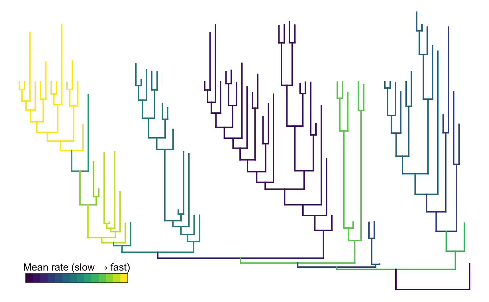

```{r setup, include = FALSE}
knitr::opts_chunk$set(
  collapse = TRUE,
  comment = "#>",
  fig.align = "center",
  out.width = "100%",
  dpi = 170,
  fig.retina = 2,
  dev = "png",
  eval = FALSE
)
source("rate-map-jaw-shape/rate-map-helpers.R")
```

```{r rate_map_style, echo = FALSE, results = "asis", eval = TRUE}
rate_map_include_style()
```

## Overview

The [jaw-shape vignette](jaw-shape-vignette.html) fits one conservative
`bifrost` search to Paleozoic fish lower-jaw shape data from
[Troyer et al. (2025)](https://doi.org/10.1016/j.cub.2025.08.008). It then
colors the selected SIMMAP-style tree by fitted regime-specific rates.

Here we use `rateMap()` in two steps. First, compute a reusable `"rateMap"`
object from a list of completed `bifrost` searches. Then, call `plot()` on that
object to render a first-pass equal-weight map, inspect the fitted-rate range,
and redraw the map with explicit near-zero metadata. Because ordinary
`bifrost` shifts occur at nodes, the default computed summary is one fitted
log-rate per branch.

The same rate-diagnostic controls can be used with a single fitted search; here
we introduce them after the first-pass sensitivity map, where the broad
fitted-rate range makes the display choice visible.

Methodologically, `rateMap()` follows the `phytools` SIMMAP plotting ecosystem:
it is a rate-valued analogue of `densityMap()`, and the plot method renders
through `plotSimmap()` and `plotTree()`. Details and acknowledgements are
collected near the end of the vignette and in `?plot.rateMap`.

This vignette is self-contained for the `rateMap()` workflow, while the
biological setup comes from the main jaw-shape analysis. Long-running search
chunks are shown for interactive use; run them once, save the fitted objects,
and then use the lighter `rateMap()` chunks for summaries and `plot(x, ...)`
chunks for display. Part 2 continues with IC weighting, uncertainty views, and
same-topology tree samples.

```{r single_run_rate_map, echo = FALSE, eval = TRUE, fig.align = "center", out.width = "80%", fig.cap = "**Figure 1. Single-run branch-rate visualization from the jaw-shape example.** This tree shows the fitted branch-rate categories for one selected `bifrost` search on the jaw-shape data; branch colors encode the regime-specific fitted evolutionary rates from that single model. The multi-run `rateMap()` workflow below asks which parts of this single-run pattern persist when the search threshold changes; subsequent maps use log fitted rates by default.", fig.alt = "Upward-oriented phylogenetic tree without tip labels. Branches are colored using a viridis gradient, with yellow branches representing faster inferred evolutionary rates and dark purple branches representing slower rates."}

```

## Why a Threshold Sweep?

Simulation-based assessment is the primary way to evaluate method-level
performance because the generating model, true shift locations, and true rates
are known. Simulations ask whether a threshold recovers real shifts, avoids
false positives, and behaves well across tree sizes, trait dimensions, and
effect sizes. The GIC threshold used in the main jaw-shape analysis follows that
logic: values near 20 are conservative, but neighboring thresholds still deserve
a dataset-specific sensitivity check.

The sweep here asks a narrower empirical question: does the jaw-shape rate
pattern persist as the shift acceptance threshold becomes more or less
conservative?
`rateMap()` turns repeated `bifrost` searches into branchwise summaries that
help distinguish high-rate regions that persist across threshold settings from
features that appear only under permissive settings. This complements
simulation-based model-performance assessment: simulations benchmark the method,
while threshold sweeps diagnose robustness in this dataset.

We keep `min_descendant_tips` fixed throughout the sweep. That argument defines
which internal nodes may receive candidate shifts; changing it would change the
candidate-shift universe and the evidence threshold at the same time. Holding it
constant isolates the acceptance threshold. For the jaw-shape data,
`min_descendant_tips = 10` also avoids fitting separate high-dimensional
covariance structure to very small clades. That value is a worked-example
choice, not a general default: real analyses may need smaller or larger values
depending on tree size, trait dimensionality, and the smallest clades that
should be allowed to carry their own fitted regime.

## Setup

Load the packages used in the jaw-shape workflow. `geomorph::two.d.array()`
converts the packaged landmark array into a two-dimensional species-by-trait
matrix, matching the setup in the main jaw-shape vignette.

```{r load_packages}
# Load the search, phylogenetic, and landmark-shape dependencies.
library(bifrost)
library(ape)
library(phytools)
library(geomorph)
```

Load and align the same data used in the jaw-shape vignette.

```{r load_jaw_shape_data}
# Locate and read the packaged jaw-shape tree and landmark coordinates.
tree_path <- system.file(
  "extdata", "jaw-shape", "mrbayes_prune_tree.RDS",
  package = "bifrost"
)
landmark_path <- system.file(
  "extdata", "jaw-shape", "jaws_coords.RDS",
  package = "bifrost"
)

fish.tree <- readRDS(tree_path)
landmarks <- readRDS(landmark_path)

# Standardize the tree and align the trait rows to its tip order.
fish.tree <- ladderize(untangle(as.phylo(fish.tree)))
fish.data <- two.d.array(landmarks)
fish.data <- fish.data[match(fish.tree$tip.label, rownames(fish.data)), ]

stopifnot(identical(rownames(fish.data), fish.tree$tip.label))
```

## Run the Sensitivity Sweep

The main jaw-shape vignette uses `shift_acceptance_threshold = 20`. We include
that value and several neighboring choices. Lower thresholds accept smaller IC
improvements; higher thresholds usually accept fewer shifts.

```{r define_threshold_grid}
# Define the acceptance thresholds and minimum candidate-clade size.
threshold_grid <- c(10, 15, 20, 25, 30, 40)
min_tips <- 10
```

Use a helper function so every run differs only in the IC threshold. Per-shift
support weights from `searchOptimalConfiguration()` are optional here: set
`uncertaintyweights_par = TRUE` only if you need those diagnostics for each
individual search. They differ from the fit-level weights used by
`rateMap(weights = "ic")`, which come from each retained run's `optimal_ic` and
`IC_used`.

Think of `rateMap()` as the post-processing compute step: it extracts fitted
branch-rate trees and regime-rate parameters, matches branches across retained
runs, and returns a reusable `"rateMap"` object. The common compute controls in
this vignette are
`weights`, `uncertainty`, `summary`, and `log`. Once the object exists, use
`plot(x, ...)` for display. Most users can stop there. Use `rateMapView(x, ...)`
only when you want to freeze a display mapping before printing category tables
or reusing the exact same categories in multiple figures. More specialized
controls can be passed as `control = list(...)` or built with
`rateMapControl()`; these are mainly for posterior-tree samples, interval maps,
custom extractors, or large sensitivity sets.

The sweep is the slowest part of the workflow. The examples below save the
fitted searches to a local cache and reload them for the lighter `rateMap()`
summaries. Run the sweep chunk once, then reuse the saved results while
exploring display, weighting, and uncertainty options.

```{r run_threshold_sweep}
# Wrap the search so threshold is the only setting that changes across runs.
run_jaw_threshold <- function(threshold) {
  searchOptimalConfiguration(
    baseline_tree              = fish.tree,
    trait_data                 = fish.data,
    formula                    = "trait_data ~ 1",
    min_descendant_tips        = min_tips,
    num_cores                  = 4,
    shift_acceptance_threshold = threshold,
    uncertaintyweights_par     = FALSE,
    IC                         = "GIC",
    method                     = "H&L",
    error                      = TRUE,
    plot                       = FALSE,
    store_model_fit_history    = FALSE,
    verbose                    = TRUE
  )
}

# Run the reproducible threshold sweep and label each retained fit.
set.seed(1)
jaw_threshold_runs <- lapply(threshold_grid, run_jaw_threshold)
names(jaw_threshold_runs) <- paste0("GIC_threshold_", threshold_grid)

# Cache the expensive searches for the lighter mapping examples that follow.
cache_path <- rate_map_cache_path()
dir.create(dirname(cache_path), recursive = TRUE, showWarnings = FALSE)
saveRDS(jaw_threshold_runs, cache_path)
```

If the searches have already been run, load the saved results instead.

```{r load_threshold_sweep}
# Restore the cached searches and recover their numeric threshold values.
cache_path <- rate_map_cache_path()
if (!file.exists(cache_path)) {
  stop("No jaw-shape threshold cache found; run the sweep chunk first.")
}
jaw_threshold_runs <- readRDS(cache_path)
threshold_grid <- as.numeric(sub("GIC_threshold_", "", names(jaw_threshold_runs)))
```

Before mapping rates, inspect how the selected model changes across the sweep.

```{r summarize_threshold_sweep}
# Compare selected-model complexity and IC improvement across thresholds.
sweep_summary <- data.frame(
  threshold = threshold_grid,
  n_shifts = vapply(
    jaw_threshold_runs,
    function(x) length(x$shift_nodes_no_uncertainty),
    integer(1)
  ),
  baseline_ic = vapply(jaw_threshold_runs, `[[`, numeric(1), "baseline_ic"),
  optimal_ic = vapply(jaw_threshold_runs, `[[`, numeric(1), "optimal_ic"),
  IC_used = vapply(jaw_threshold_runs, `[[`, character(1), "IC_used")
)
sweep_summary$delta_ic <- sweep_summary$baseline_ic - sweep_summary$optimal_ic
sweep_summary
```

```{r sweep_summary_static, echo = FALSE, results = "asis", eval = TRUE}
rate_map_table(
  "sweep_summary.csv",
  drop = "shift_nodes",
  full_width_caption = TRUE,
  caption = rate_map_caption(
    "Table 1. Observed threshold sweep.",
    "Each row is one completed search with min_descendant_tips = 10.",
    "`threshold` is the shift-acceptance threshold; `n_shifts` is the number",
    "of retained shifts; `baseline_ic` and `optimal_ic` compare the unshifted",
    "and selected models; `IC_used` records the criterion; and `delta_ic` is",
    "baseline_ic - optimal_ic. Accepted shifts are not perfectly monotonic",
    "because changing the threshold can alter the greedy search path, not just",
    "trim a fixed list of candidate shifts."
  )
)
```

This table gives a first diagnostic. In this run, the main jaw-shape threshold
(`20`) gives the lowest GIC among the six retained searches, closely followed by
threshold `30`. Those two model outcomes dominate the IC-weighted rate map in
Part 2.

## Equal-Weight Rate Map

A simple first diagnostic gives every threshold run equal weight. This asks
whether the same branch log-rate pattern appears across the threshold settings
considered here.

By default, `rateMap()` follows `bifrost`'s branch-level framing: shifts occur
at nodes, so each branch receives one summarized fitted rate. With the default
`log = TRUE`, across-run means are mean log-rates, equivalent to the log of a
weighted geometric mean on the original rate scale.

`plot(x, ...)` then colors those branch summaries as ordered log-rate
categories. In multi-run summaries, these categories are plotting bins for
summarized branch values; they should not be read as newly inferred `bifrost`
regimes. For branch summaries, `rate_categories` reports how many branches fall
into each displayed bin and summarizes the plotted branch values assigned to
that bin.

Branch maps also carry rate diagnostics for near-zero or isolated high-tail
rates. These diagnostics add `rate_flag` metadata without removing branches or
changing fitted values. By default, no near-zero rule is applied. Supplying
`zero_floor` activates the manual floor rule; using `method = "tail_cluster"`
requests the data-driven lower-tail diagnostic.

That conservative default matters because `bifrost` can infer very low but
positive fitted rates for clades with little observed trait variation. Leaving
those branches unflagged is not wrong; it shows the fitted branch summaries
directly. If you have a biologically or numerically meaningful threshold in
mind, supply `zero_floor` to mark rates below that value as effectively zero for
display. `rateMap()` leaves that choice explicit rather than guessing a
universal cutoff.

Start with the default map and inspect its range before deciding how to display
it.

```{r equal_weight_first_pass}
# Compute the unflagged equal-weight map as an initial diagnostic.
jaw_rate_map_equal_first <- rateMap(
  jaw_threshold_runs,
  weights = "equal",
  uncertainty = TRUE,
  progress = TRUE
)

# Freeze a common categorical display before inspecting its fitted-rate range.
jaw_rate_map_equal_first <- rateMapView(
  jaw_rate_map_equal_first,
  palette = "Viridis",
  legend_title = "Mean log fitted rate"
)

# Inspect both the map summary and its rate diagnostics.
jaw_rate_map_equal_first
jaw_rate_map_equal_first$rate_diagnostics
```

```{r equal_weight_first_pass_print_static, echo = FALSE, eval = TRUE}
rate_map_print_file("rate_map_equal_initial_print.txt")
```

```{r equal_weight_first_pass_diagnostics_static, echo = FALSE, results = "asis", eval = TRUE}
rate_map_table(
  "rate_map_equal_initial_diagnostics.csv",
  full_width_caption = TRUE,
  caption = rate_map_caption(
    "Table 2. First-pass equal-weight rate diagnostics.",
    "The default diagnostic pass leaves all branches in the regular category,",
    "but the fitted log-rate range is still enormous. This is a flag that the",
    "researcher should inspect the map and fitted-rate range before accepting",
    "the default color scale."
  )
)
```

The first pass is a useful warning rather than a final display choice. The
branch summaries run from about `-24.2` to `-11.4` on the log-rate scale, which
corresponds to original fitted rates of about `3.08e-11` to `1.11e-5`. A
`361,000`-fold range is possible under the fitted model, but it is biologically
hard to interpret as ordinary rate variation. That is the reason to inspect the
lower tail and, when appropriate, display the effectively zero-rate branches as
a separate diagnostic category. The default plot legend spans the prettier
category boundaries, here `-26` to `-10`, so its lower limit is a bin edge rather
than the observed minimum branch summary.

```{r plot_equal_weight_first_pass_ratemap, fig.width = 8, fig.height = 6, fig.cap = "**Figure 2. Default equal-weight branch-category rate map.** This first-pass arc tree shows the unmodified default display: all branches are binned into the ordinary ordered log-rate categories, with no manual near-zero flagging.", fig.alt = "Arc-style phylogenetic tree colored by the default equal-weight branch log-rate categories across the jaw-shape threshold sweep."}
# Draw the default map before applying a near-zero diagnostic.
plot(
  jaw_rate_map_equal_first,
  type = "arc",
  show_tip_labels = FALSE,
  legend_fsize = 0.9,
  arc_height = 0.5
)
```

```{r equal_weight_first_pass_ratemap_static, echo = FALSE, eval = TRUE, fig.align = "center", out.width = "100%", fig.cap = "**Figure 2. Default equal-weight branch-category rate map.** This first-pass arc tree shows the unmodified default display: all branches are binned into the ordinary ordered log-rate categories, with no manual near-zero flagging.", fig.alt = "Arc-style phylogenetic tree colored by the default equal-weight branch log-rate categories across the jaw-shape threshold sweep."}
knitr::include_graphics(rate_map_artifact("equal_weight_branch_category_ratemap_default.png"))
```

```{r rebuild_equal_weight_first_pass_figure, include = FALSE, eval = FALSE}
rate_map_save_arc_figure(
  "equal_weight_branch_category_ratemap_default.png",
  jaw_rate_map_equal_first
)
```

In this jaw-shape example, the lowest-rate branches form a broader lower-tail
cluster that deserves an explicit diagnostic display choice.

The second pass keeps the same fitted values but uses the `tail_cluster`
diagnostic. This Otsu-style rule, adapted from Otsu's histogram thresholding
criterion ([Otsu 1979](https://doi.org/10.1109/TSMC.1979.4310076)), works on
log-rates, chooses the guarded two-class split that maximizes separation between
the tail and the remaining branches, and only accepts it when the lower cluster
is separated from the regular branches and greatly reduces the regular fold
range.

```{r equal_weight_branch_category_ratemap}
# Recompute the equal-weight map with separated lower-tail branches flagged.
jaw_rate_map_equal <- rateMap(
  jaw_threshold_runs,
  weights = "equal",
  uncertainty = TRUE,
  progress = TRUE,
  control = rateMapControl(
    rate_flags = rateMapRateFlags(method = "tail_cluster")
  )
)

# Apply a categorical Viridis view to the regular-rate branches.
jaw_rate_map_equal <- rateMapView(
  jaw_rate_map_equal,
  palette = "Viridis",
  legend_title = "Mean log fitted rate"
)

# Inspect the adjusted map and the resulting display categories.
jaw_rate_map_equal
jaw_rate_map_equal$rate_categories
```

After flagging, the grey near-zero category sits outside the ordered palette.
The Viridis colors are regenerated for the remaining regular categories, so
the unflagged branches use the full low-to-high color range. The legend still
spans the full plotted data range and marks the cluster cutoff, here about
`-18.39`, between the highest near-zero branch (`-19.79`) and the first regular
branch (`-16.99`). In this example the first occupied regular automatic bin
starts at `-17`; use explicit `category_breaks` if you want the display anchored
to a particular numeric cutoff.

```{r equal_weight_print_static, echo = FALSE, eval = TRUE}
rate_map_print_file("rate_map_equal_print.txt")
```

The category table and diagnostic table should be read together: the left table
shows how branch summaries are binned for display, and the right table records
the near-zero rule that created the grey category.

```{r equal_weight_category_diagnostics_static, echo = FALSE, results = "asis", eval = TRUE}
equal_category_caption <- rate_map_caption(
  "Table 3. Equal-weight rate categories after near-zero flagging.",
  "Ordered log-rate bins used to color the equal-weight branch-category map.",
  "`rate_category` is the displayed interval or special near-zero category;",
  "`n_branches` counts branches in each displayed category; and `value_mean`",
  "summarizes the plotted branch log-rates assigned to each bin."
)

equal_diagnostic_caption <- rate_map_caption(
  "Table 4. Equal-weight rate diagnostics after near-zero flagging.",
  "Diagnostic companion to Table 3.",
  "`method = \"tail_cluster\"` marks the separated lower log-rate cluster as a",
  "display category without removing branches or changing fitted values.",
  "Fitted-rate bounds are shown on the plotted log scale."
)

equal_category_keep <- c(
  "rate_category",
  "n_branches",
  "value_mean"
)

if (knitr::is_html_output()) {
  cat('<div class="rate-map-table-grid rate-map-table-grid-wide-left">\n<div>\n')
  cat(rate_map_table_html(
    "rate_map_equal_categories.csv",
    keep = equal_category_keep,
    caption = equal_category_caption
  ))
  cat('\n</div>\n<div>\n')
  cat(rate_map_table_html(
    "rate_map_equal_rate_diagnostics.csv",
    caption = equal_diagnostic_caption
  ))
  cat('\n</div>\n</div>\n')
} else {
  cat(
    paste(rate_map_table(
      "rate_map_equal_categories.csv",
      keep = equal_category_keep,
      caption = equal_category_caption
    ), collapse = "\n"),
    "\n\n",
    paste(rate_map_table(
      "rate_map_equal_rate_diagnostics.csv",
      caption = equal_diagnostic_caption
    ), collapse = "\n"),
    sep = ""
  )
}
```

The near-zero category is metadata, not a data filter. The full fitted-rate
range is still available in `jaw_rate_map_equal$intervals`, but the ordinary
rate bins and the visual color scale now describe the remaining regular
branches rather than stretching across a numerical floor.

```{r plot_equal_weight_branch_category_ratemap, fig.width = 8, fig.height = 6, fig.cap = "**Figure 3. Equal-weight branch-category rate map after near-zero flagging.** This arc tree summarizes the six GIC-threshold searches by giving each completed search the same weight. Branches in the separated lower log-rate cluster are shown as a separate grey category; remaining regular branches are colored by ordered categories of their mean fitted branch log-rate.", fig.alt = "Arc-style phylogenetic tree with grey near-zero branches and colored equal-weight branch log-rate categories across the jaw-shape threshold sweep."}
# Draw the adjusted map with near-zero branches outside the ordered palette.
plot(
  jaw_rate_map_equal,
  type = "arc",
  show_tip_labels = FALSE,
  legend_fsize = 0.9,
  arc_height = 0.5
)
```

```{r equal_weight_branch_category_ratemap_static, echo = FALSE, eval = TRUE, fig.align = "center", out.width = "100%", fig.cap = "**Figure 3. Equal-weight branch-category rate map after near-zero flagging.** This arc tree summarizes the six GIC-threshold searches by giving each completed search the same weight. Branches in the separated lower log-rate cluster are shown as a separate grey category; remaining regular branches are colored by ordered categories of their mean fitted branch log-rate.", fig.alt = "Arc-style phylogenetic tree with grey near-zero branches and colored equal-weight branch log-rate categories across the jaw-shape threshold sweep."}
knitr::include_graphics(rate_map_artifact("equal_weight_branch_category_ratemap.png"))
```

Each threshold run contributes one sixth of the branch log-rate summary. The
highest mean log-rate region occurs in the lungfish-centered part of the tree,
including branches descending toward *Griphognathus*, *Holodipterus*,
*Rhynchodipterus*, and related taxa.

Interpret this map as a sensitivity average, not as a posterior probability
map. Branches with consistently high log-rate values are repeatedly assigned to
faster regimes across the threshold sweep; intermediate categories may reflect
either genuinely moderate rates or a mixture of low- and high-rate assignments
across thresholds.

If you want tighter control over the display categories after this diagnostic
step, adjust the plotting bins directly.

```{r category_controls_example, eval = FALSE}
# Compare automatic, equal-width, and explicit numeric category controls.
plot(jaw_rate_map_equal, n_categories = 5)
plot(jaw_rate_map_equal, n_categories = 5, category_bin_method = "equal")
plot(jaw_rate_map_equal, category_breaks = c(-17, -15, -13, -11))
```

When manual numeric `category_breaks` define unequal intervals, the category
legend uses proportional segment widths so the displayed bin geometry follows
the numeric rate scale.

## Practical Takeaways

- Holding `min_descendant_tips = 10` fixed keeps the candidate-node filter
  constant while `shift_acceptance_threshold` changes.
- Equal weights summarize robustness across selected threshold settings.
- The first-pass rate diagnostics are part of the workflow: inspect the
  fitted-rate range before accepting the default color scale.
- The default diagnostic pass applies no near-zero rule; manual floors and
  broader tail structure should be requested explicitly.
- `method = "tail_cluster"` is display metadata, not a data filter. It uses an
  Otsu-style two-class split to mark a separated lower log-rate cluster while
  preserving fitted values in the output object.
- In `plot(x, ...)`, `n_categories` sets the target number of automatic
  category bins; `category_bin_method = "equal"` and `category_breaks` give
  more direct bin control; numeric manual breaks also set proportional category
  legend segment widths; `ncolors` controls continuous ramps.

## Next Steps

Part 2 continues from this adjusted equal-weight map and asks how the
interpretation changes under IC weighting, across-threshold uncertainty maps,
same-topology tree samples, original-scale rates, and branch-level diagnostic
tables.

Read [Part 2: Weighting, uncertainty, and diagnostics](rate-map-jaw-shape-part-2-comparisons.html).

## Acknowledgements and Provenance

The core idea is adapted from
[`phytools::densityMap()`](https://rdrr.io/cran/phytools/man/densityMap.html):
summarize mapped histories on a shared tree and display the summary as a
colored phylogeny. `rateMap()` changes the mapped quantity from posterior state
probability to fitted branch-rate summaries from completed `bifrost` searches.

The drawing layer uses
[`phytools::plotSimmap()`](https://rdrr.io/cran/phytools/man/plotSimmap.html),
with [`phytools::plotTree()`](https://rdrr.io/cran/phytools/man/plotTree.html)
for outline and base-tree passes. `plot.rateMap()` forwards tree-layout controls
such as `type`, `fsize`, `ftype`, `lwd`, `mar`, `direction`, `offset`, `xlim`,
`ylim`, `underscore`, and `arc_height`; rate-map controls such as `palette`,
`color_mode`, `n_categories`, `category_breaks`, `legend_title`, and near-zero
diagnostics are handled by `rateMap()` before the colored tree is drawn.

This vignette was developed with assistance from OpenAI tools for drafting and
editing; all scientific content, interpretation, and final decisions were
reviewed by the authors.

## References

- Clavel, J., Aristide, L., and Morlon, H. (2019). *A Penalized Likelihood Framework for High-Dimensional Phylogenetic Comparative Methods and an Application to New-World Monkeys Brain Evolution*. [https://doi.org/10.1093/sysbio/syy045](https://doi.org/10.1093/sysbio/syy045)
- Otsu, N. (1979). *A threshold selection method from gray-level histograms*. *IEEE Transactions on Systems, Man, and Cybernetics*, 9(1), 62-66. [https://doi.org/10.1109/TSMC.1979.4310076](https://doi.org/10.1109/TSMC.1979.4310076)
- Paradis, E., and Schliep, K. (2019). *ape 5.0: an environment for modern phylogenetics and evolutionary analyses in R*. *Bioinformatics*, 35, 526-528. [https://doi.org/10.1093/bioinformatics/bty633](https://doi.org/10.1093/bioinformatics/bty633)
- Revell, L. J. (2013). *Two new graphical methods for mapping trait evolution on phylogenies*. *Methods in Ecology and Evolution*, 4, 754-759.
- Revell, L. J. (2014). *Graphical methods for visualizing comparative data on phylogenies*. Chapter 4 in *Modern Phylogenetic Comparative Methods and Their Application in Evolutionary Biology: Concepts and Practice*, 77-103.
- Revell, L. J. (2024). *phytools 2.0: an updated R ecosystem for phylogenetic comparative methods (and other things).* *PeerJ*, 12, e16505. [https://doi.org/10.7717/peerj.16505](https://doi.org/10.7717/peerj.16505)
- Troyer, E. M., et al. (2025). *Macroevolutionary role reversals in the earliest radiation of bony fishes*. [https://doi.org/10.1016/j.cub.2025.08.008](https://doi.org/10.1016/j.cub.2025.08.008)

## Software Used in This Vignette

- `bifrost` for shift searches and `rateMap()` summaries.
- `geomorph` for converting landmark arrays to species-by-trait matrices.
- `ape` and `phytools` for phylogenetic data structures, SIMMAP trees, and plotting.
